```{r setup, include=FALSE}
knitr::opts_chunk$set(warning = FALSE, message = FALSE, 
                      fig.retina = 3, fig.align = "center")
```

```{r packages-data, include=FALSE}
library(flipbookr)
library(cowplot)
ggplot2::theme_set(theme_cowplot())

```

```{r xaringanExtra, echo=FALSE}
xaringanExtra::use_xaringan_extra(c("tile_view"))
xaringanExtra::use_animate_css()
xaringanExtra::use_animate_all("fade")
xaringanExtra::use_clipboard()
```

class: center middle main-title section-title-1

# Data Wrangling with .kjh-yellow[R] and the .kjh-yellow[Tidyverse]

.class-info[

**Session 1**

.light[Kieran Healy<br>
Statistical Horizons, April 2022]

]

---

layout: true
class: title title-1

---

# Housekeeping

&nbsp;

--

## 10am till 2pm US EST

--

## Lab session from 4pm to 5pm US EST

- On First and Second Days

--

## .kjh-blue[Use the Zoom chat to ask questions, or raise a hand with ]

???

- breaks: At 11am, around noon, and 1pm

---

# In between class sessions

<br />

## <figure alt="Slack logo" title="Slack logo"></figure>

???

- Slack is super useful

---

# For a better Zoom experience


.pull-left.center[
<figure>
  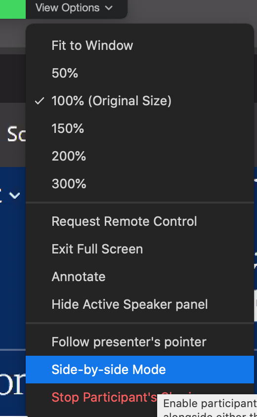
</figure>
]

- If you're watching in full-screen view and I'm sharing my screen, then from Zoom's "View options" menu _turn off_ "Side-by-Side" mode.

---

# My Setup and Yours

&nbsp;

--

## Talking, Slides, and Live-Coding in RStudio 

## Follow along with RStudio yourself if you can

## The course packet is also an RStudio project and the place for your notes

---

# Goals for this first session

&nbsp;

--

## Some big-picture motivation & perspective

## Getting familiar with RStudio and its relationship to R

## Getting oriented to R and how it thinks

???
Maybe you're familiar with R already, but I don't assume it. So please bear with me. I do find that, often, it's good to revisit some of the basic features of R and RStudio, as very often people learn them on an as-needed basis, which leads to some gaps. So hopefully even if you are a bit familiar with these tools you'll learn some new things.

---

layout: false
class: main-title main-title-inv

# .middle.squish4[<br />.kjh-orange[DATA ANALYSIS]<br />is mostly<br />.kjh-red[DATA WRANGLING]]

---

layout: true
class: title title-1

---


# Wrangling data is frustrating

.center[
  
]


---

# Can we make it .kjh-yellow[fun]?

.pull-left.center[
<figure>
  
</figure>
]

--

.pull-right[.box-inv-1.huge[.kjh-red[**No.**]]]

--

.pull-right[.box-inv-1.small[&nbsp; ⇦ Not _this_ much fun, at any rate]]

---

# OK but can we eliminate frustration?

.pull-left[
<figure>
  
</figure>
]

--

.pull-right[.box-inv-1.huge[.kjh-orange[**Also no.**]]]

--

.pull-right[.box-inv-1.small[&nbsp; Sorry.]]


---

layout: false
class: main-title main-title-inv

# .middle.squish4[<br /><br />HOWEVER, WE _CAN_<br />MAKE IT _.kjh-green[WORK]_]

--

- Also, it's weirdly satisfying once you get into it.

---

layout: true
class: title title-1

---

# We take a broadly _.kjh-yellow[Plain Text]_ approach

.pull-left[
<figure>
  
</figure>
]

--

- Using R and the Tidyverse can be understood within this broader context. 

- The same principles would apply to, e.g., using Python or similar tools.

---

layout: false
class: main-title main-title-inv

# .middle.squish4[Two revolutions<br/>in computing]

---

layout: true
class: title title-1

---

# Where the action is

.pull-left.center[
<figure>
  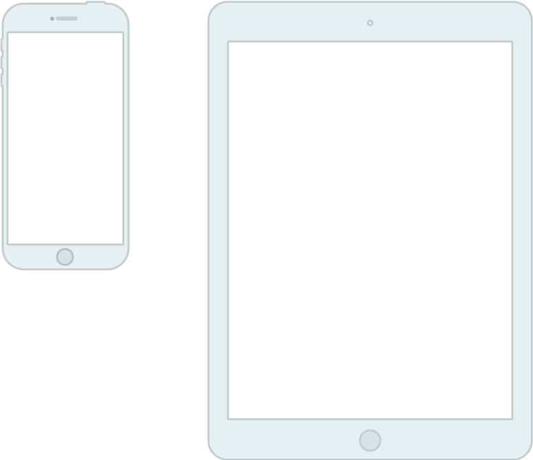
</figure>
]

--

- Touch\-based user interface

--

- Foregrounds a single application

--

- Dislikes multi-tasking\*

--

- Hides the file system

---

# \*Multitasking

.middle[I mean, “Making different specialized applications and resources work together in the service of a single but multi-dimensional project”, not “Checking Twitter while also listening to a talk and waiting for an update from the school nurse.”]

---

# Where statistical computing lives

.pull-left[
<figure>
  
</figure>
]

--

- Windows and pointers.

--

- Multi-tasking, multiple windows.

--

- Exposes and leverages the file system.

--

- Many specialized tools in concert.

--

- Underneath, it's the 1970s, UNIX, and the command-line. 

---

# Plain-Text Tools for Data Analysis

.pull-left[
<figure>
  
</figure>
]

--

- Better than they've ever been!

--

- Free! Open! Powerful!

--

- Friendly community! Many resources!

--

- But grounded in a UI paradigm that is increasingly far away from the everyday use of computing devices 

--

- So why do we use these tools?
---

layout: false
class: main-title main-title-inv

# .middle[The research process is _.kjh-orange[intrinsically messy]_]
--

## A rough distinction: "Office" vs "Engineering" approaches

---

layout: true
class: title title-1

---

# Questions

.less-medium[
- What is "real" in your project?

- What is the final output?

- How is it produced?

- How are changes managed?
]

---

# Different Answers

.pull-left.SMALL[

## In the Office model

- Formatted documents are real.

- Intermediate outputs are cut and pasted into documents.

- Changes are tracked inside files.

- Final output is often in the same format you've been working in, e.g. a Word file, or perhaps a PDF.

]

--

.pull-right.SMALL[

## In the Engineering model

- Plain-text files are real.

- Intermediate outputs are produced via code, often inside documents.

- Changes are tracked outside files.

- Final outputs are assembled programatically and converted to a desired output format.
]

---

# Different strengths and weaknesses

.pull-left.SMALL[

- Everyone knows Word, Excel, or Google Docs.

- "Track changes" is powerful and easy.

- Hm, why can't I remember how I made this figure?.

- Where did this table of results come from?.

- .small[`Paper_Submitted_Final_edits_FINAL_kh-1.docx`]

]

--

.pull-right.SMALL[

- Plain text is universally portable.

- Push button, recreate analysis.

- Why can't I make R do this simple thing?

- This version control stuff is a pain.

- .small[`Object of type 'closure' is not subsettable`]

]

--

## .center[Each approach generates solutions to its own problems]

---

layout: false
class: main-title main-title-inv

# .middle[<br />INTO THE KITCHEN]

---

layout: true
class: title title-1

---

.left[]

.right[]

---

# RStudio is an IDE for R

.center[]

---

# A kitchen is an IDE for Meals

.center[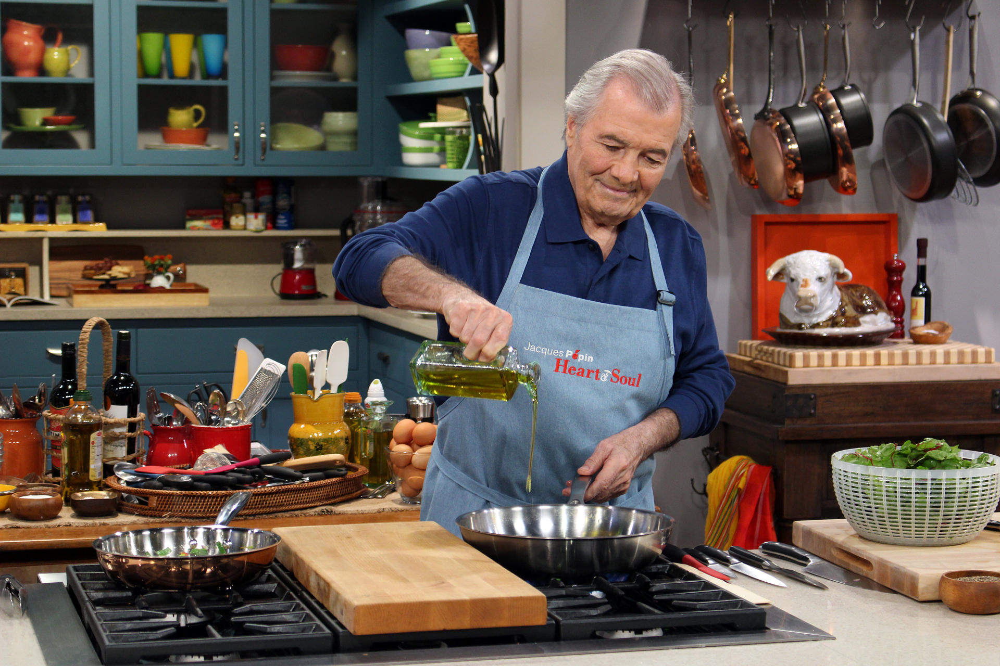]

---

# R & RStudio

.center[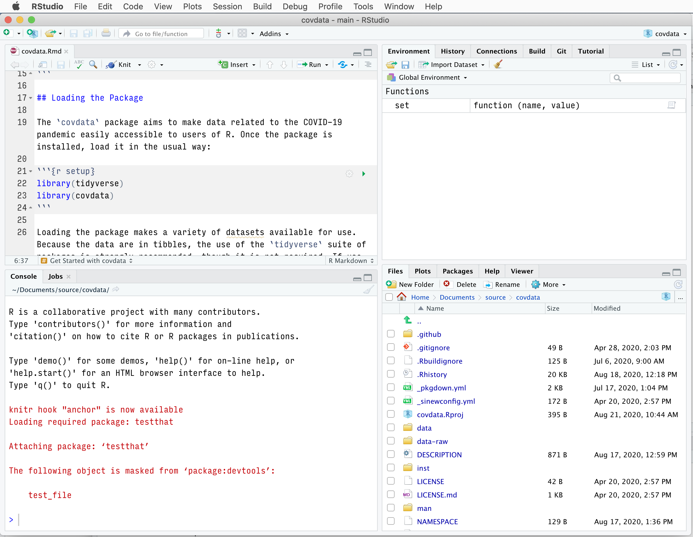]

???

SWITCH TO MAC HERE

---

# R & RStudio

.center[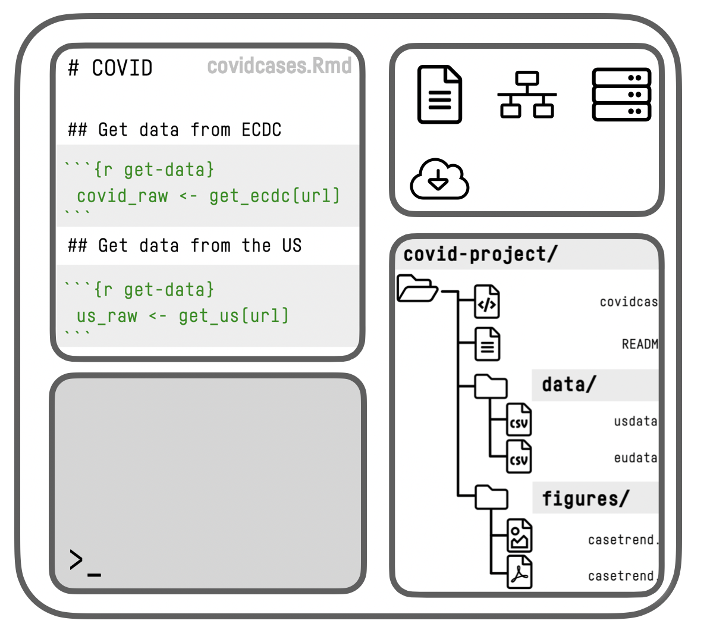]

---

# R & RStudio

.center[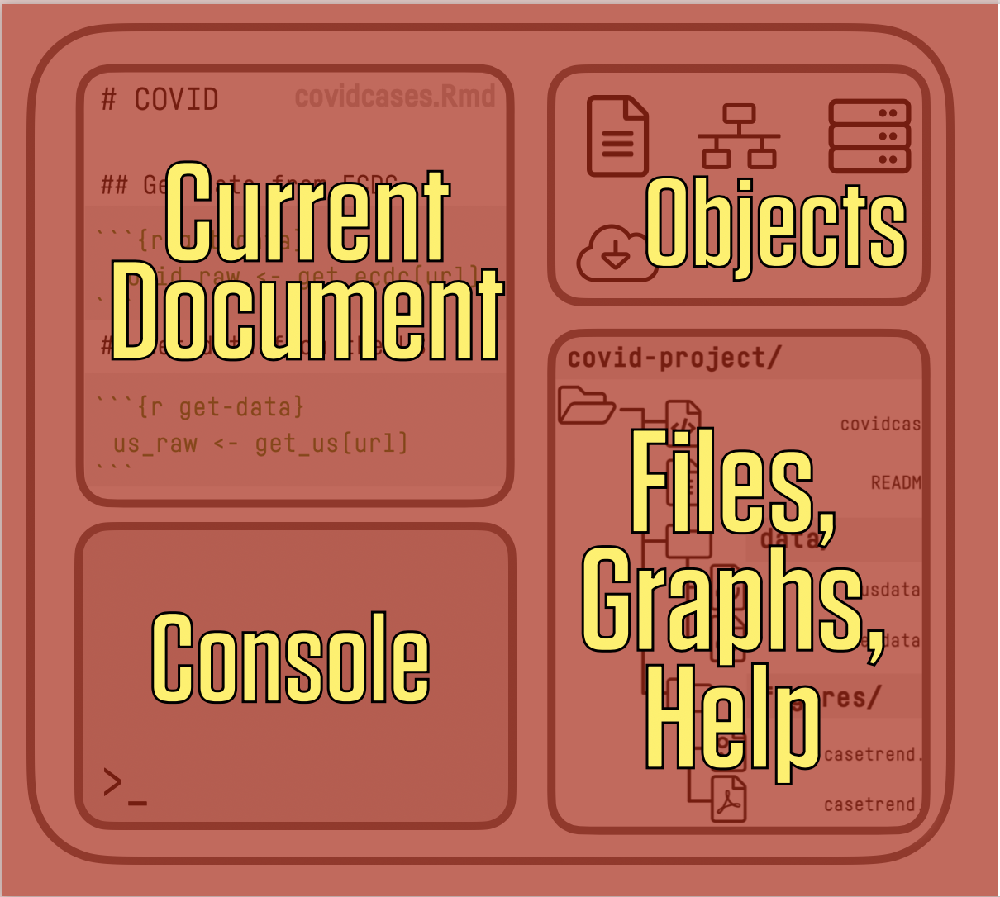]

---

# RStudio

.center[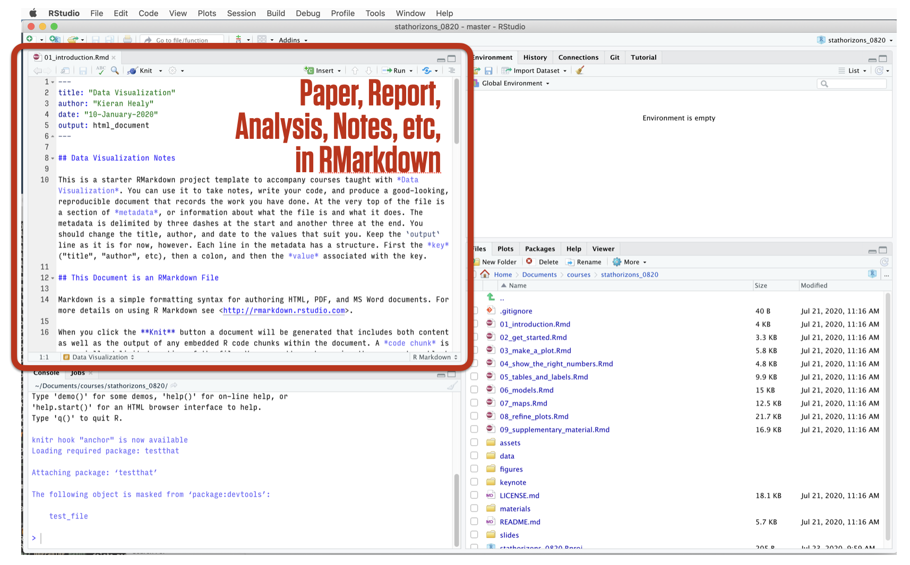]

---

# R & RStudio

.center[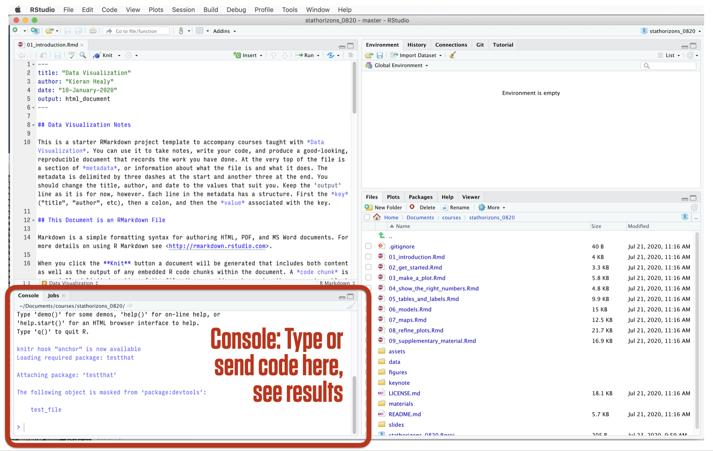]

---

# R & RStudio

.center[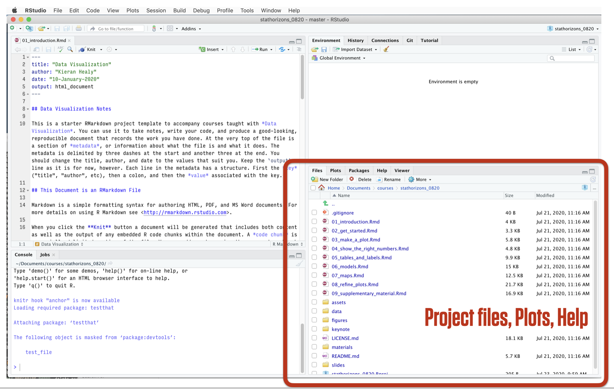]

---

# R & RStudio

.center[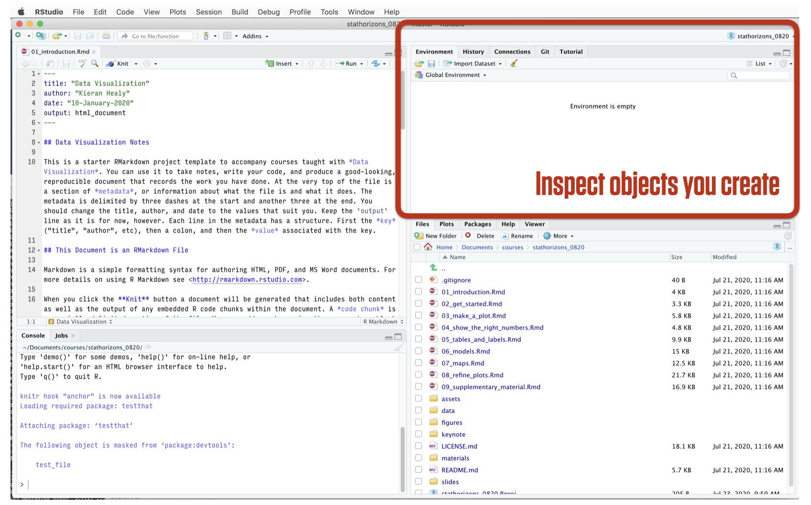]

---

# R & RStudio

.center[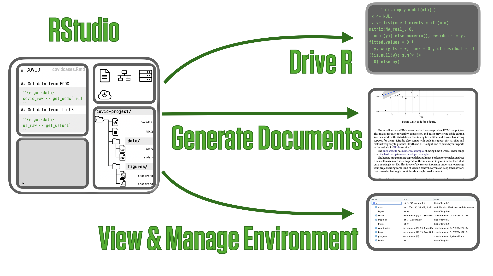]

---

# Your code is what's real in your project

.center[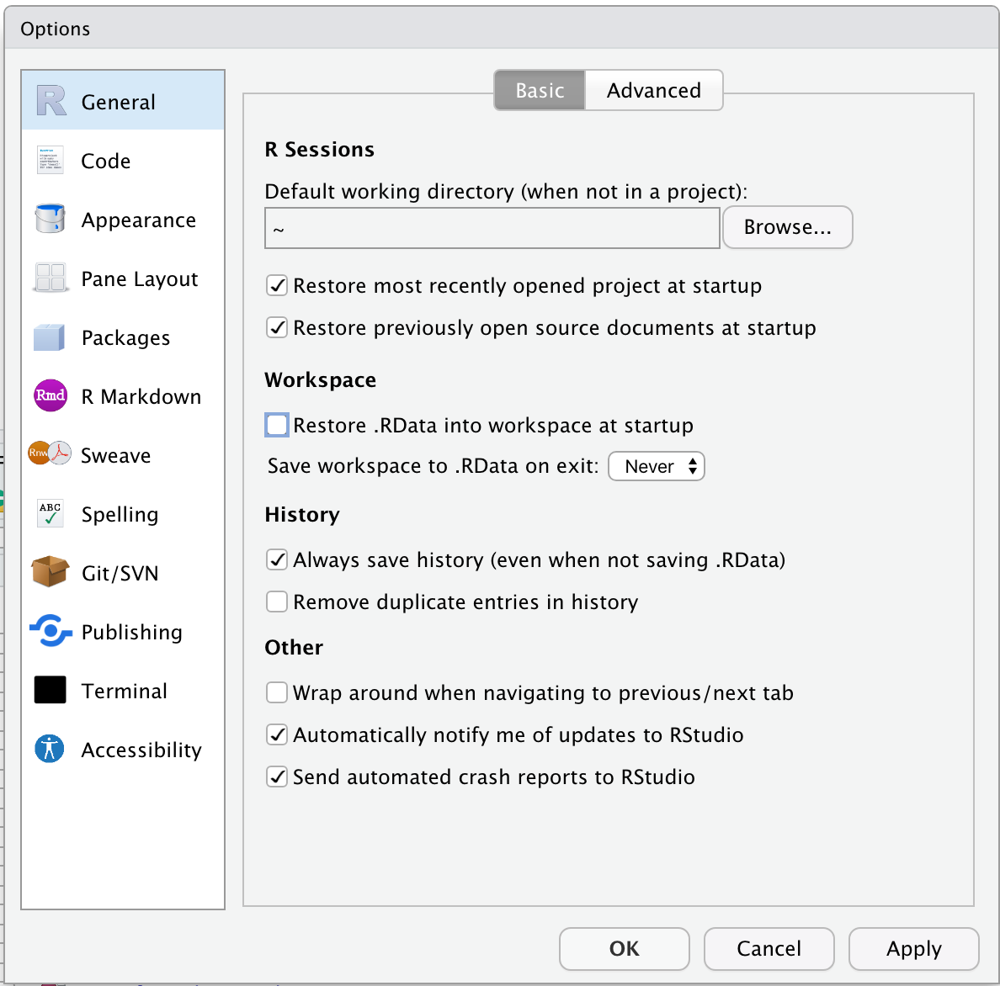]

---

# Consider not showing output inline

.center[]
