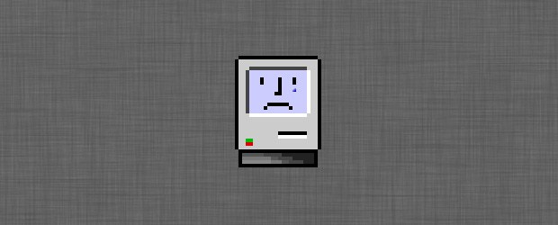

```{r setup, include=FALSE}
knitr::opts_chunk$set(warning = FALSE, message = FALSE, 
                      fig.retina = 3, fig.align = "center")
```

```{r packages-data, include=FALSE}
library(flipbookr)
library(cowplot)
ggplot2::theme_set(theme_cowplot())

```

```{r xaringanExtra, echo=FALSE}
xaringanExtra::use_xaringan_extra(c("tile_view"))
xaringanExtra::use_animate_css()
xaringanExtra::use_animate_all("fade")
xaringanExtra::use_clipboard()
```

class: center middle main-title section-title-1

# Data Wrangling with R and the Tidyverse

.class-info[

**Day 1**

.light[Kieran Healy<br>
Statistical Horizons, April 2021]

]

---

layout: true
class: title title-1

---

# Housekeeping

&nbsp;

--

## 10am till 2pm US EST

--

## Lab session from 5pm to 6pm US EST

--

## .kjh-blue[Use the Zoom chat to ask questions, or raise a hand with ]

???

- Very useful
-  I can pop questions up on screen for everyone to see.


---

# In between class sessions

## <figure alt="Slack logo" title="Slack logo"></figure>

???

- Slack is super useful

---

# For a better Zoom experience


.pull-left.center[
<figure>
  
</figure>
]

- If you're watching in full-screen view and I'm sharing my screen, then from Zoom's "View options" menu _turn off_ "Side-by-Side" mode

---

# This Morning's Goals

&nbsp;

--

## Some big-picture motivation & perspective

--

## Getting familiar with RStudio and its relationship to R

--

## Getting oriented to R and how it thinks

???
Maybe you're familiar with R already, but I don't assume it. So please bear with me. I do find that, often, it's good to revisit some of the basic features of R and RStudio, as very often people learn them on an as-needed basis, which leads to some gaps. So hopefully even if you are a bit familiar with these tools you'll learn some new things.

---

layout: false
class: main-title main-title-inv

# .middle[<br />.kjh-orange[**Data Analysis**]<br />is mostly<br />.kjh-red[**Data Cleaning**]]

---

layout: true
class: title title-1

---


# Wrangling data is frustrating

.center[
  
]


---

# Can we make it .kjh-yellow[fun]?

.pull-left.center[
<figure>
  
</figure>
]

--

.pull-right[.box-inv-1.large[.kjh-red[**No.**]]]

--

.pull-right[.box-inv-1.small[Not _this_ much fun, at any rate]]

---

# OK but can we eliminate frustration?

.pull-left[
<figure>
  
</figure>
]

--

.pull-right[.box-inv-1.large[.kjh-orange[**Also no.**]]]

--

.pull-right[.box-inv-1.small[Sorry.]]


---

layout: false
class: main-title main-title-inv

# .middle[HOWEVER, WE _CAN_ MAKE IT _.kjh-green[WORK]_]

--

### Also, it's weirdly satisfying once you get into it

---

layout: true
class: title title-1

---

# 
