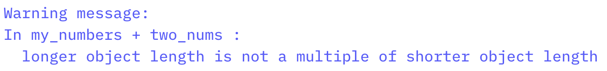

```{r setup, include=FALSE}
knitr::opts_chunk$set(warning = FALSE, message = FALSE, 
                      fig.retina = 3, fig.align = "center")
```

```{r packages-data, include=FALSE}
library(flipbookr)
library(cowplot)
ggplot2::theme_set(theme_cowplot())

```

```{r xaringanExtra, echo=FALSE}
xaringanExtra::use_xaringan_extra(c("tile_view"))
xaringanExtra::use_animate_css()
xaringanExtra::use_animate_all("fade")
xaringanExtra::use_clipboard()
```

class: center middle main-title section-title-1

# Finding your way in .kjh-yellow[R]

.class-info[

**Day 1**

.light[Kieran Healy<br>
Statistical Horizons, April 2021]

]

---

layout: false
class: main-title main-title-inv

# .middle.squish4[Using RMarkdown to .kjh-orange[produce] and .kjh-green[reproduce] your work]

---

layout: true
class: title title-1

---

# Where we want to end up

.center[]  

---

# Where we want to end up

.center[]  

---

# Where we want to end up

.center[]  

---

# How to get there?

.pull-left[] 

.pull-right[

- Write an R script with some notes inside. Create some figures and tables, paste them into our document.

- This will work, but we can do better.

]

---

# We can make this ...


.center[]  

---

# ... by writing this

.center[]  

---

# The code gets replaced by its output


.pull-left[]

.pull-right[]

---

layout: false
class: main-title main-title-inv

.center[]  

---

.center[]  

---

.pull-left[]  

.pull-right[

- This approach has its limitations, but it's very useful.

- When learning R, stick with the defaults at the beginning. Later, you can customize the look of the output in all kinds of ways.
]

---

layout: true
class: title title-1

---


# The right frame of mind

- This is like learning how to drive a car, or how to cook in a kitchen ... or learning to speak a language.

--

- After some orientation to what's where, you will learn best by _doing_.

--

- Software is a pain, but you won't crash the car or burn your house down. 

---

# The right frame of mind 

- Don't be afraid of the IDE or code. Expect to be frustrated, and don't be surprised when things go wrong. Things will go wrong _constantly_. The software is a very powerful, very obedient, and _very_ dumb robot.

--

- But every time things "don't work", and every time you diagnose and fix them, you will become a little more adept at noticing and fixing these errors. And you will start to accumulate practical knowledge of common failures.

--

- So be like Jacques and keep at it.

---

layout: false
class: main-title main-title-inv

## .top.large[TYPE OUT YOUR CODE .kjh-orange[BY HAND]]

--

- .left.SMALL[_By far_ the best way to get a feel for R works, and to get comfortable with the cycle of try-fail-fix-retry that is a permanent part of writing any code.]


---

.center[]

---

layout: false
class: main-title main-title-inv

# .middle.squish4[<br />GETTING <br />O.kjh-orange[R]IENTED]

---

layout: true
class: title title-1

---

# Loading the tidyverse libraries

```{r, message = TRUE}
library(tidyverse)
```

---

# Tidyverse components

.center[]

---

# Tidyverse components

.center[]

---

# What R looks like


- Code you can type and run:

```{r}
## Inside code chunks, lines beginning with a # character are comments
## Comments are ignored by R

my_numbers <- c(1, 1, 2, 4, 1, 3, 1, 5) # Anything after a # character is ignored as well

```

- Output

- .smaller[Equivalent to running the code above, typing `my_numbers` at the console, and hitting enter.]

```{r}
my_numbers 
```

---

# What R looks like

- By convention, code output in documents is prefixed by `##`

```{r}
my_numbers 
```


--

- .small[Also by convention, outputting vectors, etc, gets a counter keeping track of the number of elements. For example,] 

```{r}
letters
```


---

layout: false
class: main-title main-title-inv

# .top.large.squish4[SOME THINGS<br />TO KNOW<br />ABOUT .kjh-orange[R]] 

---

layout: true
class: title title-1

---

# 0. .kjh-yellow[It's a calculator]

.pull-left[

- Arithmetic


```{r}
(31 * 12) / 2^4
```

```{r}
sqrt(25)
```

```{r}
log(100)

log10(100)

```

]

--

.pull-right[

- Logic

```{r}
4 < 10
4 > 2 & 1 > 0.5 # The "&" means "and"
4 < 2 | 1 > 0.5 # The "|" means "or"
4 < 2 | 1 < 0.5
```
]

---

# Boolean and Logical operators

- Logical equality and inequality (yielding a .kjh-green[`TRUE`] or .kjh-red[`FALSE`] result) is done with `==` and `!=`. Other logical operators include `<`, `>`, `<=`, `>=`, and `!` for negation.

```{r}

## A logical test
2 == 2
```

```{r, eval = FALSE}
## This will cause an error, because R will think you are trying to assign a value
2 = 2

## Error in 2 = 2 : invalid (do_set) left-hand side to assignment
```

```{r}
3 != 7
```

---

# .kjh-red[Watch out!]

- Here's a gotcha. You might think you could write `3 < 5 & 7` and have it be interpreted as "Three is less than five and also less than seven [True or False?]":

```{r}
3 < 5 & 7
```

--

- It seems to work!

---

# .kjh-red[Watch out!]

- But now try `3 < 5 & 1`, where your intention is "Three is less than five and also less than one [True or False?]"

.pull-left[

```{r}
3 < 5 & 1
```

- .smaller.squish1[What's happening is that `3 < 5` is evaluated first, and resolves to .kjh-green[TRUE], leaving us with the expression .kjh-green[`TRUE`] `& 1`. R interprets this as .kjh-green[`TRUE`] `& as.logical(1)`. In Boolean algebra, `1` resolves to  .kjh-green[`TRUE`]. Any other number is .kjh-red[`FALSE`]. So,]

```{r}
TRUE & as.logical(1)
```

]

--

.pull-right[

```{r}
3 < 5 & 3 < 1
```

- .smaller[You have to make your comparisons explicit.]


]

---

# Logic and floating point arithmetic

- Let's evaluate `0.6 + 0.2 == 0.8`

--

```{r}
0.6 + 0.2 == 0.8
```

--

- Now let's try `0.6 + 0.3 == 0.9`

--

```{r}
0.6 + 0.3 == 0.9
```

--

- Er. That's not right.

--

- Welcome to floating point math!

---

# Logic and floating point arithmetic

- .small[In Base 10, you can't precisely express fractions like] $\frac{1}{3}$ and $\frac{1}{9}$. .small[They come out as repeating decimals: 0.3333... or 0.1111... You _can_ cleanly represent fractions that use a prime factor of the base, which in the case of Base 10 are 2 and 5.] 

--

- .small[Computers represent numbers as binary (i.e. Base 2) floating-points. In Base 2, the only prime factor is 2. So] $\frac{1}{5}$ or $\frac{1}{10}$ .small[in binary would be repeating.] 

---

# Logic and floating point arithmetic

- When you do binary math on repeating numbers and convert back to decimals you get tiny leftovers, and this can mess up _logical_ comparisons of equality. The `all.equal()` function exists for this purpose.

--

```{r}
print(.1 + .2)
print(.1 + .2, digits=18)

all.equal(.1 + .2, 0.3)
```

--

- See e.g. [https://0.30000000000000004.com](https://0.30000000000000004.com) 

---

layout: false
class: main-title main-title-inv

# .middle.squish4[More later on why this might bite you, and how to deal with it]

--

- .smaller[For now, "Be very careful about doing logical comparisons on floating-point numbers" is not a bad rule.]

---

layout: true
class: title title-1

---

# 1. .kjh-yellow[Everything in R has a name]

```{r}
my_numbers # We created this a few minutes ago

letters  # This one is built-in

pi  # Also built-in
```

---

# Some names are forbidden

- Or it's a _really_ bad idea to try to use them 

```{r, eval = FALSE}
TRUE
FALSE
Inf
NaN 
NA 
NULL

for
if
while
break
function
```

---

# 2. .kjh-yellow[Everything is an object]

- .SMALL[There are a few built-in objects]


```{r}
letters
```

--

```{r}
pi
```

--

```{r}

LETTERS
```

---

# 3. .kjh-yellow[You can create objects] 

--

- In fact, this is mostly what we will be doing

--

- Objects are created by .kjh-red[assigning] a thing to a name:

```{r}
## name... gets ... this stuff
my_numbers <- c(1, 2, 3, 1, 3, 5, 25, 10)

## name ... gets ... the output of the function `c()`
your_numbers <- c(5, 31, 71, 1, 3, 21, 6, 52)
```

--

- The `c()` function _combines_ or _concatenates_ things

???

The core thing we do in R is _create objects_ by _assigning a thing to a name_. That thing is usually the output of some _function_. There are a lot of built-in functions.

We can create an object with the `c()` function and the *assignment operator*, `<-`. The `c()` function concatenates things together.


---

# The assignment operator

- The assignment operator performs the action of creating objects

--

- Use a keyboard shortcut to write it:

- Press `option` _and_ `-` on a Mac

- Press `alt` _and_ `-` on Windows


---

# Assignment with `=`

- You can use "`=`" as well as "`<-`" for assignment

```{r}
my_numbers = c(1, 2, 3, 1, 3, 5, 25)

my_numbers
```


--

- On the other hand, "`=`" has a different meaning when used in functions.

--

- I'm going to use "`<-`" for assigment throughout. 

- Just be consistent either way.

---

# Assignment with `=`

.center[]

???

--- 

layout: true
class: title title-1

---

# 4. .kjh-yellow[Do things to objects with functions]


```{r create_objects_again}

## this object... gets ... the output of this function
my_numbers <- c(1, 2, 3, 1, 3, 5, 25, 10)

your_numbers <- c(5, 31, 71, 1, 3, 21, 6, 52)
```

```{r 02-get-started-3}
my_numbers
```

- Functions can be identified by the parentheses after their names.

```{r 02-get-started-4}
my_numbers 
```


```{r this_will_error, eval = FALSE}
## If you run this you'll get an error
mean()
```

---

# What functions usually do

- They take .kjh-orange[**inputs**] to .kjh-pink[**arguments**]

- They perform .kjh-red[**actions**]

- They produce, or return, .kjh-green[**outputs**]


## .kjh-red[`mean`(].kjh-orange[`x`] `=` .kjh-pink[`my_numbers`].kjh-red[)]

--

## .kjh-green[`[1] 6.25`]

---

# What functions usually do

```{r}
## Get the mean of what? Of x.
## You need to tell the function what x is
mean(x = my_numbers)

mean(x = your_numbers)
```

--

- If you don't _name_ the arguments, R assumes you are providing them in the order the function expects.

```{r}
mean(your_numbers)
```

---

# What functions usually do

- What arguments? Which order? Read the function's help page

```{r, eval=FALSE}
help(mean)
```

```{r, eval = FALSE}
## quicker
?mean
```

--

- How to read an R help page ... 

---

# What functions usually do


- Arguments often tell the function what to do in specific circumstances

```{r}
missing_numbers <- c(1:10, NA, 20, 32, 50, 104, 32, 147, 99, NA, 45)

mean(missing_numbers)

mean(missing_numbers, na.rm = TRUE)
```

--

- Or select from one of several options

```{r}
## Look at ?mean to see what `trim` does
mean(missing_numbers, na.rm = TRUE, trim = 0.1)
```


---

# What functions usually do


- There are all kinds of functions. They return different things.

```{r}
summary(my_numbers)
```

--

- You can assign the output of a function to a name, which turns it into an object. (Otherwise it'll send its output to the console.)

```{r}
my_summary <- summary(my_numbers)

my_summary
```

---

# What functions usually do

- Objects hang around in your work environment until they are overwritten by you, or are deleted.

```{r, eval = FALSE}
## rm() function removes objects
rm(my_summary)

my_summary

## Error: object 'my_summary' not found
```

---

# Functions are bundled into .kjh-yellow[packages]

--

- Packages are loaded into your working environment using the `library()` function.

--

```{r}
## A package containing a dataset rather than functions
library(gapminder)

gapminder
```

---

# Functions are bundled into .kjh-yellow[packages]

--

- You need only _install_ a package once (and occasionally update it). But you must _load_ the package in each R session before you can access its contents.

.small[

```{r, eval = FALSE}
## Do at least once for each package. Once done, not needed each time.
install.packages("palmerpenguins", repos = "http://cran.rstudio.com")

## Needed sometimes, especially after an R major version upgrade.
update.packages(repos = "http://cran.rstudio.com")

```


]

.small[
```{r}
## To load a package, usually at the start of your RMarkdown document or script file
library(palmerpenguins)
penguins
```
]
---

# Grabbing a single function with `::`

- .small["Reach in" to an unloaded package and grab a function directly, using `<package>::<function>`]

--

```{r, message = FALSE, echo = FALSE}
gtsummary::theme_gtsummary_journal(journal = "jama")
gtsummary::theme_gtsummary_compact()
```

.small[
```{r}
## A little glimpse of what we'll do soon
penguins %>% 
  select(species, body_mass_g, sex) %>% 
  gtsummary::tbl_summary(by = species) #<<
```
]

---

# 5. .kjh-yellow[Objects come in classes]

- The object inspector in RStudio is your friend here.

--

- You can also ask an object what its class is. 

--

- Objects can have more than one (nested) class:

--

```{r}
class(my_numbers)

class(summary(my_numbers)) # functions can be nested, and are evaluated from the inside out

class(gapminder)

```

--

???

Again the object inspector is helpful here

---

# Some classes can't be directly combined

- Objects can be manually or automatically coerced from one class to another.

- In general, you should be careful with coercing objects to other classes, as it can easily lead to errors.

--

```{r 02-get-started-9}
class(my_numbers)

my_new_vector <- c(my_numbers, "Apple")

my_new_vector

class(my_new_vector)
```

---

# Some classes are nested

.pull-left[

- Base R's trusty `data.frame`

```{r titanic1}
library(socviz)
titanic
class(titanic)
```

```{r titanic2}
## The `$` idiom picks out a named column here; 
## more generally, the named element of a list
titanic$percent  
```
]

--

.pull-right[

- The Tidyverse's enhanced `tibble`

```{r titanic3}
## tibbles are build on data frames 
titanic_tb <- as_tibble(titanic) 
class(titanic)
titanic_tb
class(titanic_tb)
```
]

---

# 6. .kjh-yellow[Arithmetic on vectors]

- In R, all numbers vectors of different sorts. Even single numbers ("scalars") are conceptually vectors of length 1.

--

- Arithmetic on vectors follows a series of _recycling rules_ that favor ease of expression of vectorized, "elementwise" operations.

- See if you can predict what the following operations do: 

---

# 6. .kjh-yellow[Arithmetic on vectors]

```{r}
my_numbers

result1 <- my_numbers + 1

```

--

```{r}
result1
```

--

```{r}
result2 <- my_numbers + my_numbers

```

--

```{r}
result2
```


--


```{r, warning=TRUE}
two_nums <- c(5, 10)

result3 <- my_numbers + two_nums

```


--

```{r}
result3
```


---

# 6. .kjh-yellow[Arithmetic on vectors]

```{r, warning=TRUE}
three_nums <- c(1, 5, 10)

result4 <- my_numbers + three_nums

```

--

```{r}
result4
```

- Note that you get a _warning_ here. It'll still do it, though! Don't ignore warnings until you understand what they mean.

---

# 7. .kjh-yellow[R will be] .kjh-red[frustrating]

--

- The IDE tries its best to help you. Learn to attend to what it is trying to say.

.left[]  

--

.left[]  

--

.left[]  

---
