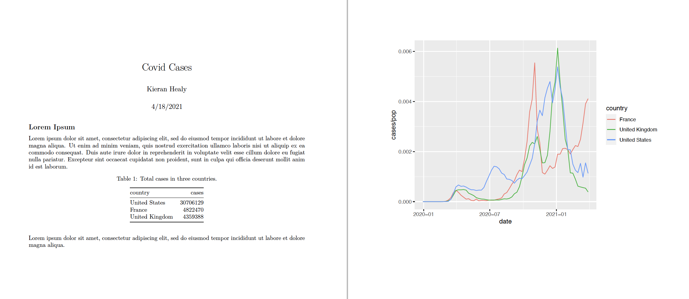
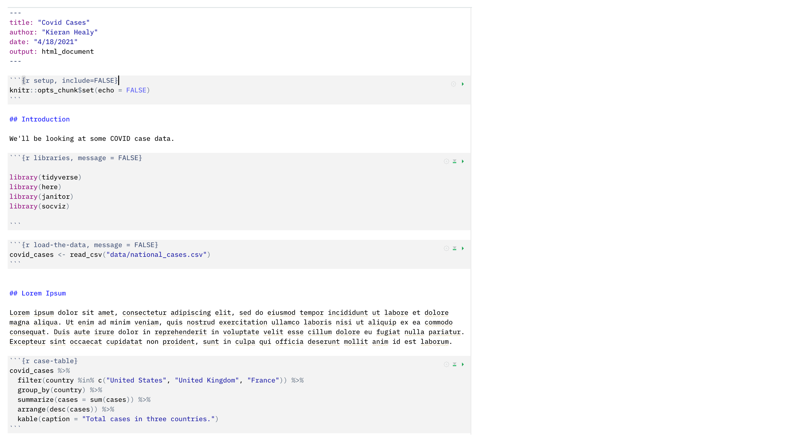
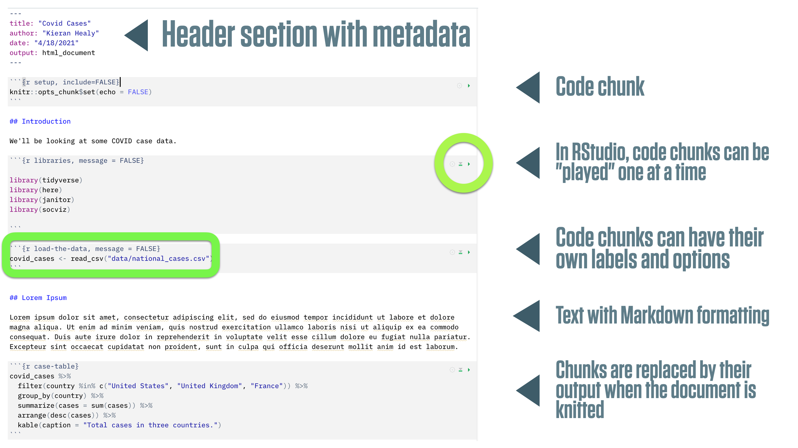
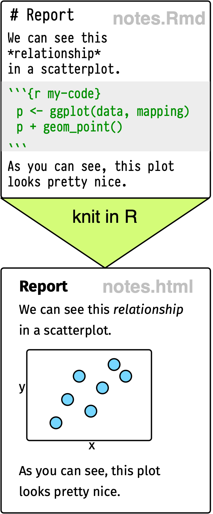
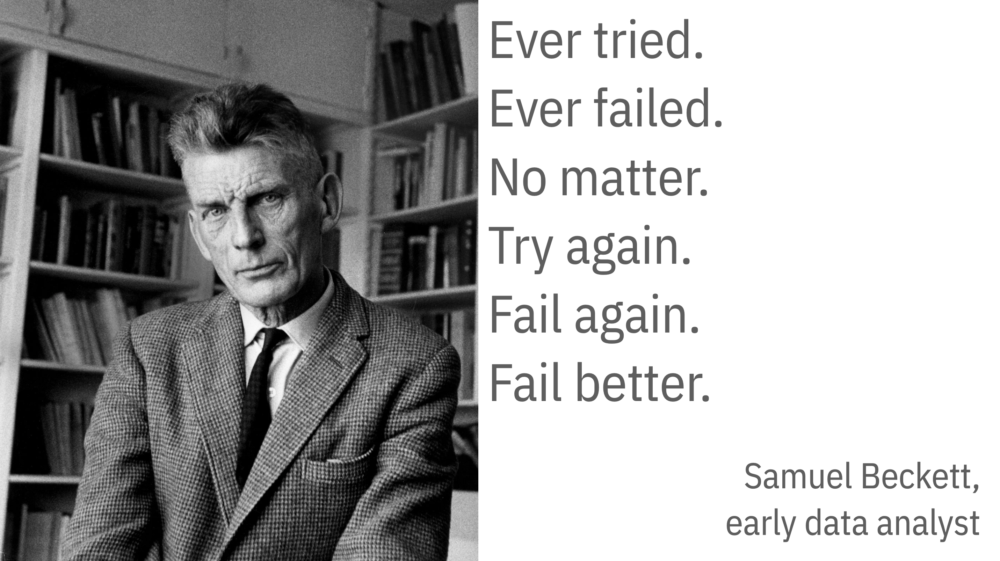
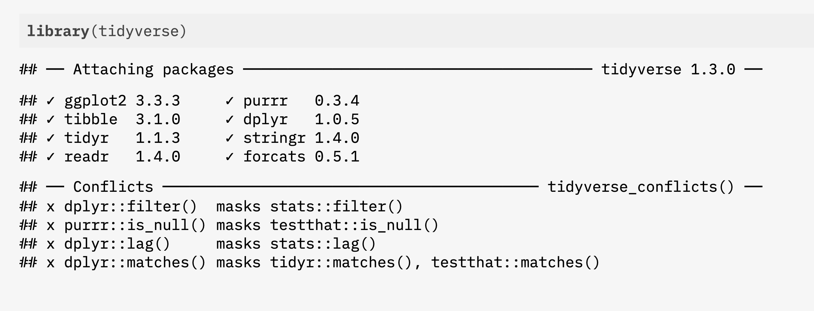
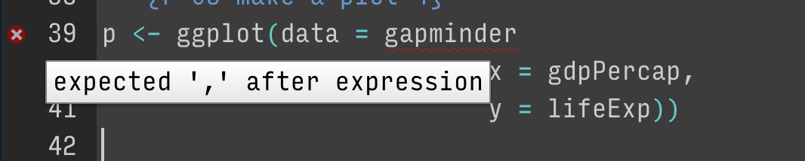
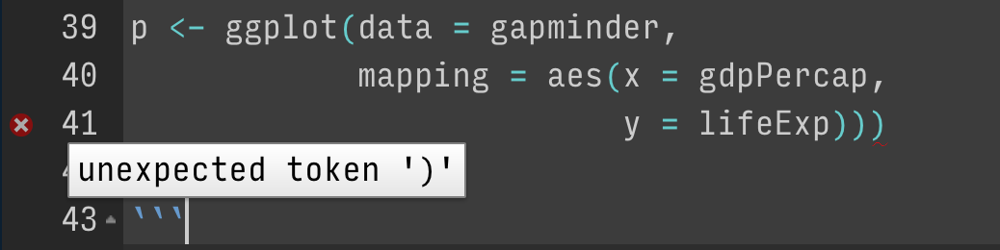

```{r packages, include=FALSE}
library(flipbookr)
library(here)
library(tidyverse)
library(kjhslides)
```


```{r setup, include=FALSE}

kjh_register_tenso()
kjh_set_knitr_opts()
kjh_set_slide_theme()
kjh_set_xaringan_opts()

```


class: center middle main-title section-title-1

# Finding your way in .kjh-yellow[R]

.class-info[

**Data Wrangling: Session 2**

.light[Kieran Healy<br>
Statistical Horizons, December 2022]

]

---

layout: false
class: center

# .huge.middle.squish4[Using RMarkdown to .kjh-orange[produce] and .kjh-green[reproduce] your work]

---

layout: true
class: title title-1

---

# Where we want to end up

.center[]  

---

# Where we want to end up

.center[]  

---

# Where we want to end up

.center[]  

---

# How to get there?

.pull-left[] 

.pull-right[

- Write an R script with some notes inside. Create some figures and tables, paste them into our document.

- This will work, but we can do better.

]

---

# We can make this ...


.center[]  

---

# ... by writing this

.center[]  

---

# The code gets replaced by its output


.pull-left[]

.pull-right[]

---

layout: false
class: center

.center[]  

---

.center[]  

---

.pull-left[]  


--

.right[

- This approach has its limitations, but it's _very_ useful.

]
---

.pull-left[]  


.pull-right[- When learning these workflows, stick with the defaults at the beginning. Later, you can customize the look of the output in all kinds of ways.]


---

layout: true
class: title title-1

---

# The right frame of mind

- This is like learning how to drive a car, or how to cook in a kitchen ... or learning to speak a language.

--

- After some orientation to what's where, you will learn best by _doing_.

--

- Software is a pain, but you won't crash the car or burn your house down. 

???

- Don't be afraid of the IDE or code. Expect to be frustrated, and don't be surprised when things go wrong. Things will go wrong _constantly_. The software is a very powerful, very obedient, and _very_ dumb robot.

- But every time things "don't work", and every time you diagnose and fix them, you will become a little more adept at noticing and fixing these errors. And you will start to accumulate practical knowledge of common failures.

- So be like Jacques and keep at it.

---

layout: false
class: center

## .top.huge.squish4[TYPE OUT<br />YOUR CODE<br />.kjh-orange[BY HAND]]

--

- .center.SMALL[_By far_ the best way to get a feel for how R works, and to get comfortable with the cycle of<br/> try-fail-cry-fix-wail-retry that is a permanent part of writing any code.]


---

.center[]

---

layout: false
class: center

# .huge.middle.squish4[<br />GETTING <br />O.kjh-orange[R]IENTED]

---

layout: true
class: title title-1

---

# Loading the tidyverse libraries

```{r 02-about-r-2, message = TRUE}
library(tidyverse)
```

The tidyverse has several components. 

We'll return to this message about Conflicts later.

---

# Tidyverse components

.pull-left.w45[

- .kjh-green[**`library`**]`(tidyverse)`
- `Loading tidyverse: ggplot2`
- `Loading tidyverse: tibble`
- `Loading tidyverse: tidyr`
- `Loading tidyverse: readr`
- `Loading tidyverse: purrr`
- `Loading tidyverse: dplyr`
]

--

.pull-right.w55[
- Call the package and ...
- `<|` **Draw graphs**
- `<|` **Nicer data tables**
- `<|` **Tidy your data**
- `<|` **Get data into R**
- `<|` **Fancy Iteration**
- `<|` **Action verbs for tables**

]

---

# What R looks like


Code you can type and run:


```{r 02-about-r-3 }
## Inside code chunks, lines beginning with a # character are comments
## Comments are ignored by R

my_numbers <- c(1, 1, 2, 4, 1, 3, 1, 5) # Anything after a # character is ignored as well

```


Output:

.smaller[Equivalent to running the code above, typing `my_numbers` at the console, and hitting enter.]

```{r 02-about-r-4 }
my_numbers 
```

---

# What R looks like

By convention, code output in documents is prefixed by `##`

.medium[
```{r 02-about-r-5 }
my_numbers 
```
]


--

Also by convention, outputting vectors, etc, gets a counter keeping track of the number of elements. For example,

.medium[
```{r 02-about-r-6 }
letters
```
]


---

layout: false
class: center

# .middle.large.squish4[<br />SOME THINGS<br />TO KNOW<br />ABOUT .kjh-orange[R]] 

---

layout: true
class: title title-1

---

# 0. .kjh-yellow[It's a calculator]

.pull-left[

- Arithmetic

.less-medium[
```{r 02-about-r-7 }
(31 * 12) / 2^4
```

```{r 02-about-r-8 }
sqrt(25)
```

```{r 02-about-r-9 }
log(100)

log10(100)

```
]

]

--

.pull-right[

- Logic
.less-medium[
```{r 02-about-r-10 }
4 < 10
4 > 2 & 1 > 0.5 # The "&" means "and"
4 < 2 | 1 > 0.5 # The "|" means "or"
4 < 2 | 1 < 0.5
```
]
]

---

# Boolean and Logical operators

Logical equality and inequality (yielding a .kjh-green[`TRUE`] or .kjh-red[`FALSE`] result) is done with `==` and `!=`. Other logical operators include `<`, `>`, `<=`, `>=`, and `!` for negation.

.medium[

```{r 02-about-r-11 }
## A logical test
2 == 2 # Write `=` twice
```

```{r 02-about-r-12, eval = FALSE}
## This will cause an error, because R will think you are trying to assign a value
2 = 2

## Error in 2 = 2 : invalid (do_set) left-hand side to assignment
```

```{r 02-about-r-13 }
3 != 7 # Write `!` and then `=` to make `!=`
```
]
---

# .kjh-red[Watch out!]

Here's a gotcha. You might think you could write `3 < 5 & 7` and have it be interpreted as "Three is less than five and also less than seven [True or False?]":

.medium[
```{r 02-about-r-14 }
3 < 5 & 7
```
]
--

It seems to work!

---

# .kjh-red[Watch out!]

But now try `3 < 5 & 1`, where your intention is "Three is less than five and also less than one [True or False?]"

.pull-left[

.medium[
```{r 02-about-r-15 }
3 < 5 & 1
```
]
.small.squish1[What's happening is that `3 < 5` is evaluated first, and resolves to .kjh-green[TRUE], leaving us with the expression .kjh-green[`TRUE`] `& 1`. 

R interprets this as .kjh-green[`TRUE`] `& as.logical(1)`. 

In Boolean algebra, `1` resolves to  .kjh-green[`TRUE`]. Any other number is .kjh-red[`FALSE`]. So,]

.medium[
```{r 02-about-r-16 }
TRUE & as.logical(1)
```
]
]

--

.pull-right[

.medium[
```{r 02-about-r-17 }
3 < 5 & 3 < 1
```
]
- .small[You have to make your comparisons explicit.]


]

---

# Logic and floating point arithmetic

Let's evaluate `0.6 + 0.2 == 0.8`


--


```{r 02-about-r-18 }
0.6 + 0.2 == 0.8
```

--

Now let's try `0.6 + 0.3 == 0.9`

--

```{r 02-about-r-19 }
0.6 + 0.3 == 0.9
```

--

Er. That's not right.

--

Welcome to floating point math!

---

# Logic and floating point arithmetic

.pull-left.w70[

In Base 10, you can't precisely express fractions like $\frac{1}{3}$ and $\frac{1}{9}$. They come out as repeating decimals: 0.3333... or 0.1111... You _can_ cleanly represent fractions that use a prime factor of the base, which in the case of Base 10 are 2 and 5. 

]

--

.pull-left.w70[

Computers represent numbers as binary (i.e. Base 2) floating-points. In Base 2, the only prime factor is 2. So $\frac{1}{5}$ or $\frac{1}{10}$ in binary would be repeating.

] 

---

# Logic and floating point arithmetic

.pull-left.w70[When you do binary math on repeating numbers and convert back to decimals you get tiny leftovers, and this can mess up _logical_ comparisons of equality. The `all.equal()` function exists for this purpose.]

--

.pull-left.w70[

```{r 02-about-r-20 }
print(.1 + .2)
print(.1 + .2, digits=18)

all.equal(.1 + .2, 0.3)
```

]
--

.pull-left.w70[

See e.g. [https://0.30000000000000004.com](https://0.30000000000000004.com) 

]

---

layout: false
class: center

# .huge.middle.squish4[More later on why this might bite you, and how to deal with it]

--

- .smaller[For now, "Be very careful about doing logical comparisons on floating-point numbers" is not a bad rule.]

---

layout: true
class: title title-1

---

# 1. .kjh-yellow[Everything in R has a name]

.medium[
```{r 02-about-r-21 }
my_numbers # We created this a few minutes ago

letters  # This one is built-in

pi  # Also built-in
```
]
---

# Some names are forbidden

Or it's a _really_ bad idea to try to use them 

.medium[
```{r 02-about-r-22, eval = FALSE}
TRUE
FALSE
Inf
NaN 
NA 
NULL

for
if
while
break
function
```
]
---

# 2. .kjh-yellow[Everything is an object]

.SMALL[There are a few built-in objects]

.medium[
```{r 02-about-r-23 }
letters
```
]
--

.medium[
```{r 02-about-r-24 }
pi
```
]
--

.medium[
```{r 02-about-r-25 }

LETTERS
```
]
---

# 3. .kjh-yellow[You can create objects] 

--

In fact, this is mostly what we will be doing.

--

Objects are created by .kjh-red[assigning] a thing to a name:


```{r 02-about-r-26 }
## name... gets ... this stuff
my_numbers <- c(1, 2, 3, 1, 3, 5, 25, 10)

## name ... gets ... the output of the function `c()`
your_numbers <- c(5, 31, 71, 1, 3, 21, 6, 52)
```

--

The .kjh-green[**`c()`**] function _combines_ or _concatenates_ things

???

The core thing we do in R is _create objects_ by _assigning a thing to a name_. That thing is usually the output of some _function_. There are a lot of built-in functions.

We can create an object with the `c()` function and the *assignment operator*, `<-`. The `c()` function concatenates things together.


---

# The assignment operator

- The assignment operator performs the action of creating objects

--

- Use a keyboard shortcut to write it:

- Press `option` _and_ `-` on a Mac

- Press `alt` _and_ `-` on Windows


---

# Assignment with .kjh-green[**`=`**]

- You can use .kjh-pink[**`=`**] as well as .kjh-pink[**`<-`**] for assignment.

.medium[
```{r 02-about-r-27 }
my_numbers = c(1, 2, 3, 1, 3, 5, 25)

my_numbers
```
]

--

- On the other hand, .kjh-pink[**`=`**] has a different meaning when used in functions.

--

- I'm going to use .kjh-pink[**`<-`**] for assignment throughout. 


- Be consistent either way.

---

# Assignment with .kjh-green[**`=`**]

.center[]

???

--- 

layout: true
class: title title-1

---

# 4. .kjh-yellow[Do things to objects with functions]

.medium[
```{r 02-about-r-28 }

## this object... gets ... the output of this function
my_numbers <- c(1, 2, 3, 1, 3, 5, 25, 10)

your_numbers <- c(5, 31, 71, 1, 3, 21, 6, 52)
```

```{r 02-about-r-29 }
my_numbers
```
]

- Functions can be identified by the parentheses after their names.

.medium[
```{r 02-about-r-30 }
my_numbers 
```


```{r 02-about-r-31, eval = FALSE}
## If you run this you'll get an error
mean()
```
]
---

# What functions usually do

- They take .kjh-pink[**inputs**] to .kjh-orange[**arguments**]

- They perform .kjh-red[**actions**]

- They produce, or return, .kjh-green[**outputs**]


## .kjh-red[`mean`(].kjh-orange[`x`] `=` .kjh-pink[`my_numbers`].kjh-red[)]

--

## .kjh-green[`[1] 6.25`]

---

# What functions usually do

```{r 02-about-r-32 }
## Get the mean of what? Of x.
## You need to tell the function what x is
mean(x = my_numbers)

mean(x = your_numbers)
```

--

If you don't _name_ the arguments, R assumes you are providing them in the order the function expects.

.medium[
```{r 02-about-r-33 }
mean(your_numbers)
```
]

---

# What functions usually do

What arguments? Which order? Read the function's help page

.medium[
```{r 02-about-r-34, eval=FALSE}
help(mean)
```

```{r 02-about-r-35, eval = FALSE}
## quicker
?mean
```
]
--

- How to read an R help page ... 

---

# What functions usually do


- Arguments often tell the function what to do in specific circumstances

.medium[
```{r 02-about-r-36 }
missing_numbers <- c(1:10, NA, 20, 32, 50, 104, 32, 147, 99, NA, 45)

mean(missing_numbers)

mean(missing_numbers, na.rm = TRUE)
```
]
--

Or select from one of several options

.medium[
```{r 02-about-r-37 }
## Look at ?mean to see what `trim` does
mean(missing_numbers, na.rm = TRUE, trim = 0.1)
```
]

---

# What functions usually do


There are all kinds of functions. They return different things.

.medium[
```{r 02-about-r-38 }
summary(my_numbers)
```
]
--

You can assign the output of a function to a name, which turns it into an object. (Otherwise it'll send its output to the console.)

.medium[
```{r 02-about-r-39 }
my_summary <- summary(my_numbers)

my_summary
```
]
---

# What functions usually do

Objects hang around in your work environment until they are overwritten by you, or are deleted.

.medium[
```{r 02-about-r-40, eval = FALSE}
## rm() function removes objects
rm(my_summary)

my_summary

## Error: object 'my_summary' not found
```
]

---

# Functions can be .kjh-yellow[nested]

.medium[
```{r 02-about-r-41 }
c(1:20)
```
]

--

.medium[
```{r 02-about-r-42 }
mean(c(1:20))
```
]
--

.medium[
```{r 02-about-r-43 }
summary(mean(c(1:20)))
```

```{r 02-about-r-44 }
names(summary(mean(c(1:20))))
```
]
--

```{r 02-about-r-45 }
length(names(summary(mean(c(1:20)))))
```

--

Nested functions are evaluated from the inside out.

---

# Use the pipe operator: .kjh-green[|>]

.SMALL[Instead of nesting functions in parentheses, we can use the _pipe operator_:]

.medium[
```{r 02-about-r-46 }
c(1:20) |> mean() |> summary() |> names() |>  length()
```
]
--

.SMALL[Read this operator as "_.kjh-green[**and then**]_"]

--

.SMALL[Better, vertical space is free in R:]

.medium[
```{r 02-about-r-47 }
c(1:20) |> 
  mean() |> 
  summary() |> 
  names() |> 
  length()
```
]
---

# Pipelines make code more .kjh-green[readable]

- Not great, Bob:

```r
  serve(stir(pour_in_pan(whisk(crack_eggs(get_from_fridge(eggs), into = "bowl"), len = 40), temp = "med-high")))
```

--

- Notice how the first thing you read is the last operation performed.

--

Really not much better:

.medium[
```r
serve(
  stir(
    pour_in_pan(
      whisk(
        crack_eggs(
          get_from_fridge(eggs), 
        into = "bowl"), 
      len = 40), 
    temp = "med-high")
  )
)
```
]
---

# Pipelines make code more .kjh-green[readable]

- Much nicer:

.medium[
```r
eggs |> 
  get_from_fridge() |> 
  crack_eggs(into = "bowl") |> 
  whisk(len = 40) |> 
  pour_in_pan(temp = "med-high") |> 
  stir() |> 
  serve()

```
]
--

- We'll still use nested parentheses quite a bit, often in the context of a function working inside a pipeline. But it's good not to have too many levels of nesting.

---


# The other pipe: .kjh-green[`%>%`]

- The Base R pipe operator, .kjh-green[**`|>`**] is a relatively recent addition to R. 

- Piping operations were originally introduced in a package called called `magrittr`, where it took the form .kjh-green[**`%>%`**]

--

- It's been so successful, a version of it has been incorporated into Base R.

--

- The Base R pipe _mostly_ but does not _quite_ work the same way as .kjh-green[**`%>%`**] in every case.


- We'll use the Base R pipe in this course, but you'll see the Magrittr pipe a lot out in the world.

.footnote.tiny[.kjh-darkgrey[\*With the Base R pipe, you can only pass an object to the _first_ argument in a function. This is fine for most tidyverse pipelines, where the first argument is usually (implicitly) the data. But it does mean that most Base R functions will continue not to be easily piped, as most of them do not follow the convention of passing the current data as the first argument]]

---

# Functions are bundled into .kjh-yellow[packages]

--

Packages are loaded into your working environment using the `library()` function.

--

.less-medium[
```{r 02-about-r-48 }
## A package containing a dataset rather than functions
library(gapminder)

gapminder
```
]
---

# Functions are bundled into .kjh-yellow[packages]

--

.SMALL.squish2[You need only _install_ a package once (and occasionally update it). But you must _load_ the package in each R session before you can access its contents.]

.SMALL[

```{r 02-about-r-49, eval = FALSE}
## Do at least once for each package. Once done, not needed each time.
install.packages("palmerpenguins", repos = "http://cran.rstudio.com")

## Needed sometimes, especially after an R major version upgrade.
update.packages(repos = "http://cran.rstudio.com")

```


]

.SMALL[
```{r 02-about-r-50 }
## To load a package, usually at the start of your RMarkdown document or script file
library(palmerpenguins)
penguins
```
]
---

# Grabbing a single function with .kjh-yellow[`::`]

.small["Reach in" to an unloaded package and grab a function directly, using `<package>::<function>`]

--

```{r 02-about-r-51, message = FALSE, echo = FALSE}
gtsummary::theme_gtsummary_journal(journal = "jama")
#gtsummary::theme_gtsummary_compact()
```

.less-medium[
```{r 02-about-r-52 }
## A little glimpse of what we'll do soon
penguins |> 
  select(species, body_mass_g, sex) |> 
  gtsummary::tbl_summary(by = species) #<<
```
]

---

# Remember this warning about conflicts?



Notice how some functions in different packages have the same names.

--

Related concepts of _namespaces_ and _environments_.

---

# Scope of names
 
.small[
```{r 02-about-r-53 }
x <- c(1:10)
y <- c(90:100)

x

y
```
]
--

.small[
```r
mean()

## Error in mean.default() : argument "x" is missing, with no default
```
]
--
.small[
```{r 02-about-r-54 }
mean(x) # argument names are internal to functions

mean(x = x)

mean(x = y)

x

y

```
]

---

# 5. Objects come in .kjh-yellow[types] and .kjh-yellow[classes]

I'm going to speak somewhat loosely here for now, and gloss over some distinctions between object classes and data structures, as well as kinds of objects and their attributes.

--

The object inspector in RStudio is your friend.

--

You can ask an object what it is. 

```{r 02-about-r-55 }
class(my_numbers)
typeof(my_numbers)
```


---

# 5. Objects come in .kjh-yellow[types] and .kjh-yellow[classes]

Objects can have more than one (nested) class:

--

```{r 02-about-r-56 }
summary(my_numbers)

my_smry <- summary(my_numbers) # remember, outputs can be assigned to a name, creating an object

class(summary(my_numbers)) # functions can be nested, and are evaluated from the inside out

class(my_smry) # equivalent to the previous line
```

---

# 5. Objects come in .kjh-yellow[types] and .kjh-yellow[classes]


```{r 02-about-r-57 }
typeof(my_smry)
attributes(my_smry)

## In this case, the functions extract the corresponding attribute
class(my_smry)
names(my_smry)
```

---

# The most common types of .kjh-green[vector]

.pull-left.tiny.kjh-darkgrey[

[]  

- From Hadley Wickham, _Advanced R_

]

--

.pull-right.normal[

```{r 02-about-r-58 }
my_int <- c(1, 3, 5, 6, 10)
is.integer(my_int)
is.double(my_int)

my_int <- as.integer(my_int)
is.integer(my_int)

my_chr <- c("Mary", "had", "a", "little", "lamb")
is.character(my_chr)

my_lgl <- c(TRUE, FALSE, TRUE)
is.logical(my_lgl)

```

]

---

# The most common types of .kjh-green[vector]

.pull-left.tiny.kjh-darkgrey[

[]  

- From Hadley Wickham, _Advanced R_

]

--

.pull-right.small[

```{r 02-about-r-59 }
## Factors are for storing undordered or ordered categorical variables
x <- factor(c("Yes", "No", "No", "Maybe", "Yes", "Yes", "Yes", "No"))
x

summary(x) # Alphabetical order by default

typeof(x)       # Underneath, a factor is a type of integer ...
attributes(x)   # ... with labels for its numbers, or "levels" 
class(x)
levels(x)
is.ordered(x)

```

]

???

HW: 

Categorical data, where values come from a fixed set of levels recorded in factor vectors.

Dates (with day resolution), which are recorded in Date vectors.

Date-times (with second or sub-second resolution), which are stored in POSIXct vectors.

Durations, which are stored in difftime vectors.

---


# Vector types can't be heterogenous 

- .small[Objects can be manually or automatically coerced from one class to another. Take care.]

--

.SMALL[
```{r 02-about-r-60 }
class(my_numbers)

my_new_vector <- c(my_numbers, "Apple")

my_new_vector # vectors are homogeneous/atomic

class(my_new_vector)
```
]
--

.SMALL[
```{r 02-about-r-61 }
my_dbl <- c(2.1, 4.77, 30.111, 3.14519)
is.double(my_dbl)

my_dbl <- as.integer(my_dbl)

my_dbl

```
]

---

# A table of data is a kind of .kjh-yellow[list]

.SMALL[
```{r 02-about-r-62 }
gapminder # tibbles and data frames can contain vectors of different types

class(gapminder)
typeof(gapminder) # hmm

```
]

.small[Lists _can_ be heterogenous. Underneath, most complex R objects are some kind of list with different components.]


???

- A _data frame_ is a list of vectors of the same length, where the vectors can be of different types (e.g. numeric, character, logical, etc)

- A _tibble_ is an enhanced data frame 

Tibbles have an enhanced print method, never coerce strings to factors, and provide stricter subsetting methods. (HW)

Again the object inspector is helpful here

---

# Some classes are versions of others

.pull-left[

- Base R's trusty `data.frame`

.SMALL[
```{r 02-about-r-63 }
library(socviz)
titanic
class(titanic)
```
]

.SMALL[
```{r 02-about-r-64 }
## The `$` idiom picks out a named column here; 
## more generally, the named element of a list
titanic$percent  
```
]
]

--

.pull-right[

- The Tidyverse's enhanced `tibble`

.SMALL[
```{r 02-about-r-65 }
## tibbles are build on data frames 
titanic_tb <- as_tibble(titanic) 
class(titanic)
titanic_tb
class(titanic_tb)
```
 ]
]

--

- A data frame and a tibble are both fundamentally a list of vectors of the same length, where the vectors can be of different types (e.g. numeric, character, logical, etc)


---

# All of this will matter later on

.SMALL[
```{r 02-about-r-66 }
gss_sm
```
]

--

.SMALL.squish2[Tidyverse tools are generally _type safe_, meaning their functions return the same type of thing every time, or fail if they cannot do this. So it's good to know about the various data types.]

---

# 6. .kjh-yellow[Arithmetic on vectors]

- In R, all numbers are vectors of different sorts. Even single numbers ("scalars") are conceptually vectors of length 1.

--

- Arithmetic on vectors\* follows a series of _recycling rules_ that favor ease of expression of vectorized, "elementwise" operations.

.footnote.tiny[*And arrays, too.]

- See if you can predict what the following operations do: 

---

# 6. .kjh-yellow[Arithmetic on vectors]

```{r 02-about-r-67 }
my_numbers

result1 <- my_numbers + 1

```

--

```{r 02-about-r-68 }
result1
```

--

```{r 02-about-r-69 }
result2 <- my_numbers + my_numbers

```

--

```{r 02-about-r-70 }
result2
```


--


```{r 02-about-r-71, warning=TRUE}
two_nums <- c(5, 10)

result3 <- my_numbers + two_nums

```


--

```{r 02-about-r-72 }
result3
```


---

# 6. .kjh-yellow[Arithmetic on vectors]

```{r 02-about-r-73, warning=TRUE}
three_nums <- c(1, 5, 10)

result4 <- my_numbers + three_nums

```

--

```{r 02-about-r-74 }
result4
```

Note that you get a _warning_ here. It'll still do it, though! Don't ignore warnings until you understand what they mean.

--- 

# 7. .kjh-yellow[R will be] .kjh-red[frustrating]

--

- The IDE tries its best to help you. Learn to attend to what it is trying to say.

.left[]  

--

.left[]  

--

.left[]  
