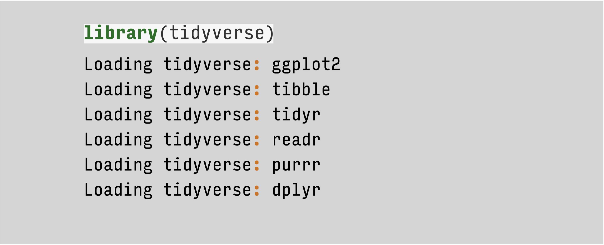
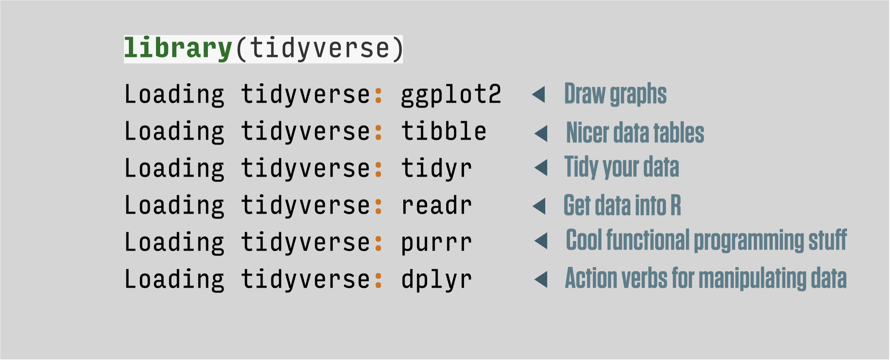
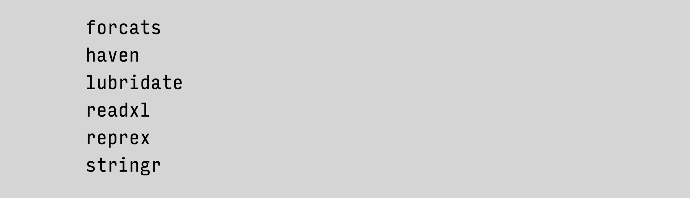
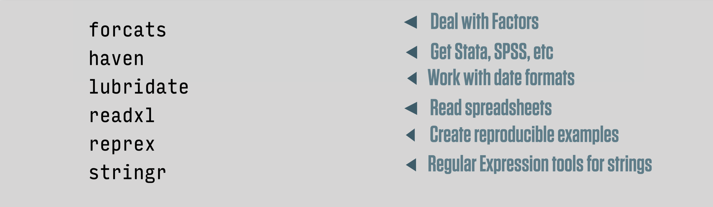

```{r setup, include=FALSE}
knitr::opts_chunk$set(warning = FALSE, message = FALSE, 
                      fig.retina = 3, fig.align = "center")
```

```{r packages-data, include=FALSE}
library(flipbookr)
library(cowplot)
ggplot2::theme_set(theme_cowplot())

```

```{r xaringanExtra, echo=FALSE}
xaringanExtra::use_xaringan_extra(c("tile_view"))
xaringanExtra::use_animate_css()
xaringanExtra::use_animate_all("fade")
xaringanExtra::use_clipboard()
```

class: center middle main-title section-title-1

# Manipulating Tables with .kjh-yellow[`dplyr`]

.class-info[

**Session 3**

.light[Kieran Healy<br>
Statistical Horizons, April 2021]

]

---

layout: false
class: main-title main-title-inv

# .middle.squish4[Time to<br />play with<br />some .kjh-red[data]]

--

- woohoo!

---

layout: true
class: title title-1

---

# Load our libraries

.SMALL[
```{r, message = TRUE}
library(here)      # manage file paths
library(socviz)    # data and some useful functions
library(tidyverse) # your friend and mine
```
]

---

# Tidyverse components, again

.center[]

---

# Tidyverse components, again

.center[]

---

# Other tidyverse components

.center[]

---

# Other tidyverse components

.center[]

---


# .kjh-yellow[dplyr] lets you work with tibbles
