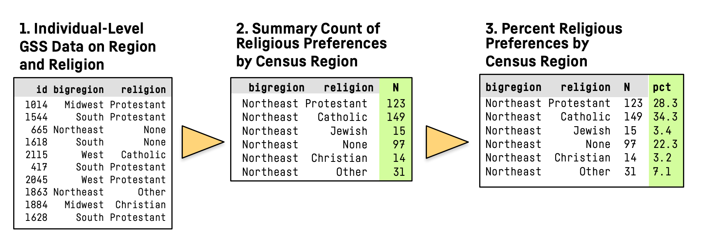

```{r 03a-dplyr-basics-1, include=FALSE}
library(flipbookr)
library(here)
library(tidyverse)
library(kjhslides)
library(xaringanExtra)
```


```{r setup, echo=FALSE}

kjh_register_tenso()

kjh_set_knitr_opts()

kjh_set_slide_theme()

kjh_set_xaringan_opts()

```


class: center middle main-title section-title-1

# Manipulating Tables with .kjh-yellow[dplyr]

.class-info[

**Data Wrangling: Session 3**

.light[Kieran Healy<br>
Statistical Horizons, April 2022]

]

---

layout: false
class: center

# .huge.middle.squish4[Time to<br />play with<br />some .kjh-red[data]]

--

- woohoo!

---

layout: true
class: title title-1

---

# Load our libraries

.SMALL[
```{r 03a-dplyr-basics-2, message = TRUE}
library(here)      # manage file paths
library(socviz)    # data and some useful functions
library(tidyverse) # your friend and mine
```
]

---

# Tidyverse components, again

.pull-left.w45[

- .kjh-green[**`library`**]`(tidyverse)`
- `Loading tidyverse: ggplot2`
- `Loading tidyverse: tibble`
- `Loading tidyverse: tidyr`
- `Loading tidyverse: readr`
- `Loading tidyverse: purrr`
- `Loading tidyverse: dplyr`
]

--

.pull-right.w55[
- Call the package and ...
- `<|` **Draw graphs**
- `<|` **Nicer data tables**
- `<|` **Tidy your data**
- `<|` **Get data into R**
- `<|` **Fancy Iteration**
- `<|` **Action verbs for tables**

]

---


# Other tidyverse components

.top[.pull-left.w15[   
- `forcats`
- `haven`
- `lubridate`
- `readxl`
- `stringr`
- `reprex`
]]

--

.top[.pull-right.w85[
- `<|` **Deal with factors**
- `<|` **Import Stata, SPSS, etc**
- `<|` **Dates, Durations, Times**
- `<|` **Import from spreadsheets**
- `<|` **Strings and Regular Expressions**
- `<|` **Make reproducible examples**
]]

--
.left.bottom[.footnote[Not all of these are attached when we do `library(tidyverse)`]]

---

# .kjh-yellow[dplyr] lets you work with tibbles

.pull-left-wide[
- Remember, tibbles are tables of data where the columns can be of different types, such as numeric, logical, character, factor, etc.]

--

.pull-left-wide[
- We'll use dplyr to _transform_ and _summarize_ our data.
]

--
.pull-left-wide[

- We'll use the pipe operator, .kjh-pink[**`%>%`**], to chain together sequences of actions on our tables.

]
---

layout: false
class: center

# .huge.middle.squish4[`dplyr` draws on the logic and language of  .kjh-green[database queries], where the focus is on manipulating tables]

---

layout: true
class: title title-1

---

# Some .kjh-orange[actions] to take on a single table 

--

.pull-left.w80[
- .kjh-orange[**Group**] the data at the level we want, such as “_Religion by Region_” or _“Children by School_”.

- .kjh-orange[**Subset**] either the rows or columns of or table.

- .kjh-orange[**Mutate**] the data. That is, change something at the _current_ level of grouping.  Mutating adds new columns to the table, or changes the content of an existing column. It never changes the number of rows.

- .kjh-orange[**Summarize**] or aggregate the data. That is, make something new at a _higher_ level of grouping. E.g., calculate means or counts by some grouping variable. This will generally result in a smaller, _summary_ table.
]

---

# Each .kjh-orange[action] is implemented by a .kjh-green[function] 

--
.pull-left-wide[
- **Group** using  .kjh-green[**`group_by()`**].
]

--

.pull-left-wide[
- **Subset** has one action for rows and one for columns. We .kjh-green[**`filter()`**] rows and .kjh-green[**`select()`**] columns. 
]
--
.pull-left-wide[
- **Mutate** tables (i.e. add new columns, or re-make existing ones) using .kjh-green[**`mutate()`**].
]
--

.pull-left-wide[
- **Summarize** tables (i.e. perform aggregating calculations) using .kjh-green[**`summarize()`**].
]

---

# General Social Survey data: .kjh-pink[`gss_sm`]

```{r 03a-dplyr-basics-3 }
## library(socviz) # if not loaded
gss_sm
```

--

Notice how the tibble already tells us a lot.

---

# Summarizing a Table

- Here's what we're going to do:

.center[]

---

# Summarizing a Table

```{r 03a-dplyr-basics-4 }
## Just take a look at the columns we will work on
gss_sm %>% 
  select(id, bigregion, religion)
```

We're just taking a look at the relevant columns here.

---

# Group by .kjh-orange[_one_] column or variable

```{r 03a-dplyr-basics-5 }

gss_sm %>% 
  group_by(bigregion)
```

Grouping just changes the logical structure of the tibble. 

---

`r chunk_reveal("03a-dplyr-basics-6", widths = c(25,75), title = "# Group and summarize by .kjh-orange[_one_] column")`


```{r 03a-dplyr-basics-6, include = FALSE}
gss_sm %>% 
  group_by(bigregion) %>% 
  summarize(total = n())
```

--

The function .kjh-green[**`n()`**] counts up the rows within each group.

--

All the other columns are dropped in the summary operation

--

Your original .kjh-pink[`gss_sm`] table is untouched

---

`r chunk_reveal("03a-dplyr-basics-7", widths = c(40,55), title = "# Group and summarize by .kjh-orange[_two_] columns")`


```{r 03a-dplyr-basics-7, include = FALSE}
gss_sm %>% 
  group_by(bigregion, religion) %>% 
  summarize(total = n())
```

--

The function .kjh-green[**`n()`**] counts up the rows within the _innermost_ (i.e. the rightmost) group.

---

`r chunk_reveal("03a-dplyr-basics-8", widths = c(40,60), title = "# Calculate frequencies")`


```{r 03a-dplyr-basics-8, include = FALSE}
gss_sm %>% 
  group_by(bigregion, religion) %>% 
  summarize(total = n()) %>% 
  mutate(freq = total / sum(total),
           pct = round((freq*100), 1))
```

--

The function .kjh-green[**`n()`**] counts up the rows 

--

Which rows? The ones fed down the pipeline

--

The _innermost_ (i.e. the rightmost) group.

---

# Pipelines carry assumptions forward

.small[
```{r 03a-dplyr-basics-9 }
gss_sm %>% 
  group_by(bigregion, religion) %>% #<<
  summarize(total = n()) %>% 
  mutate(freq = total / sum(total),
           pct = round((freq*100), 1))
```
]

Groups are carried forward till summarized or explicitly ungrouped

--

Summary calculations are done on the innermost group, which then "disappears". (Notice how it's no longer a group in the output.)

---

# Pipelines carry assumptions forward

.small[
```{r 03a-dplyr-basics-10 }
gss_sm %>% 
  group_by(bigregion, religion) %>% 
  summarize(total = n()) %>% 
  mutate(freq = total / sum(total),
           pct = round((freq*100), 1)) #<<
```
]

.kjh-green[**`mutate()`**] is quite clever. See how we can immediately use **`freq`**, even though we are creating it in the same .kjh-green[**`mutate()`**] expression.

---

# Convenience functions

.small[

```{r 03a-dplyr-basics-11 }
gss_sm %>% 
  group_by(bigregion, religion) %>% #<<
  summarize(total = n()) %>% #<<
  mutate(freq = total / sum(total),
           pct = round((freq*100), 1)) 
```
]

We're going to be doing this .kjh-green[**`group_by()`**] ... .kjh-green[**`n()`**] step a lot. Some shorthand for it would be useful.

---

# Three options for counting up rows

.pull-left-3[

- .SMALL.squish3[Do it yourself with .kjh-green[**`n()`**]]

.SMALL[
```{r 03a-dplyr-basics-12 }
gss_sm %>% 
  group_by(bigregion, religion) %>% #<<
  summarize(n = n()) #<<
```
]

- .small.squish3[Result is a grouped tibble.]
]

--

.pull-middle-3[

- .SMALL.squish3[use .kjh-green[**`tally()`**]]

.SMALL[
```{r 03a-dplyr-basics-13 }
gss_sm %>% 
  group_by(bigregion, religion) %>% 
  tally() #<<
```
]

- .small.squish3[Group it yourself; result is grouped.]
]

--

.pull-right-3[

- .SMALL.squish3[use .kjh-green[**`count()`**]]

.SMALL[
```{r 03a-dplyr-basics-14 }
gss_sm %>% 
  count(bigregion, religion) #<<
```
]

- .small.squish3[One step; result is not grouped.]
]

---

# Pass your pipeline on to ... a .kjh-yellow[table]

```{r 03a-dplyr-basics-15, eval = FALSE}
gss_sm %>% 
  count(bigregion, religion) %>% 
  pivot_wider(names_from = bigregion, values_from = n) %>%  #<<
  kable()  
```


.small[
```{r 03a-dplyr-basics-16, echo = FALSE}
gss_sm %>% 
  count(bigregion, religion) %>% 
  pivot_wider(names_from = bigregion, values_from = n) %>% 
  kable()  
```
]

More on .kjh-green[**`pivot_wider()`**] and .kjh-green[**`kable()`**] soon ...

---

# Pass your pipeline on to ... a .kjh-yellow[graph]

.SMALL[
```{r 03a-dplyr-basics-17, fig.height=4, fig.width=15}
gss_sm %>% 
  group_by(bigregion, religion) %>% 
  tally() %>% 
  mutate(pct = round((n/sum(n))*100), 1) %>% 
  drop_na() %>% 
  ggplot(mapping = aes(x = pct, y = reorder(religion, -pct), fill = religion)) + #<<
  geom_col() + #<<
    labs(x = "Percent", y = NULL) +
    guides(fill = "none") + 
    facet_wrap(~ bigregion, nrow = 1)
```
]

---

# Pass your pipeline on to ... an .kjh-yellow[object]

.pull-left[
- .SMALL.squish3[You can do it like this ...]
```{r 03a-dplyr-basics-18 }
rel_by_region <- gss_sm %>% #<<
  count(bigregion, religion) %>% 
  mutate(pct = round((n/sum(n))*100, 1)) 

rel_by_region
```
]

--

.pull-right[

- .SMALL.squish3[Or like this!]
```{r 03a-dplyr-basics-19 }
gss_sm %>% 
  count(bigregion, religion) %>% 
  mutate(pct = round((n/sum(n))*100, 1)) -> #<<
rel_by_region #<<

rel_by_region
```

]

---

# .kjh-lblue[Right] assignmment is a thing, like .kjh-red[Left]

.pull-left[

- .kjh-red[Left] assignment is standard

```{r 03a-dplyr-basics-20 }
gss_tab <- gss_sm %>% 
  count(bigregion, religion) 
```

.left[This may feel awkward with a pipe: "`gss_tab` .kjh-orange[_gets_] the output of the following pipeline."]

]

--

.pull-right[

- .kjh-lblue[Right] assignment also works!

```{r 03a-dplyr-basics-21 }
gss_sm %>% 
  count(bigregion, religion) -> gss_tab  
  
```

.right[Without any authority, I assert that right-assignment should be read as, e.g., "This pipeline .kjh-orange[_begets_] `gss_tab`"]

]
---

# Pipelined tables can be quickly checked

.pull-left[

```{r 03a-dplyr-basics-22 }
rel_by_region <- gss_sm %>% 
  count(bigregion, religion) %>% 
  mutate(pct = round((n/sum(n))*100, 1)) 

rel_by_region
```

Hm, did I sum over right group?

]

--
.pull-right[

```{r 03a-dplyr-basics-23 }
## Each region should sum to ~100
rel_by_region %>% 
  group_by(bigregion) %>% 
  summarize(total = sum(pct)) 

```

No! What has gone wrong here?

]

---

# Pipelined tables can be quickly checked

.pull-left[

```{r 03a-dplyr-basics-24 }
rel_by_region <- gss_sm %>% 
  count(bigregion, religion) %>% #<< 
  mutate(pct = round((n/sum(n))*100, 1)) 
```

.SMALL.squish3[.kjh-green[**`count()`**] returns ungrouped results, so there are no groups carry forward to the .kjh-green[**`mutate()`**] step.]

```{r 03a-dplyr-basics-25 }
rel_by_region %>% 
  summarize(total = sum(pct))
```

.SMALL.squish3[With .kjh-green[**`count()`**], the `pct` values here are the marginals for the whole table.]

]

--
.pull-right[

```{r 03a-dplyr-basics-26 }
rel_by_region <- gss_sm %>% 
  group_by(bigregion, religion) %>% #<<
  tally() %>% #<<
  mutate(pct = round((n/sum(n))*100, 1)) 
```

```{r 03a-dplyr-basics-27 }
# Check
rel_by_region %>% 
  group_by(bigregion) %>% 
  summarize(total = sum(pct))

```

.SMALL.squish3[We get some rounding error because we used `round()` after summing originally.]
]


---

# Two lessons

## Check your tables!

-     Pipelines feed their content forward, so you need to make sure your results are not incorrect.

--

- Often, complex tables and graphs can be disturbingly plausible even when wrong.

--

- So, figure out what the result should be and test it!

--

- Starting with simple or toy cases can help with this process.

---

# Two lessons

## Inspect your pipes!

- Understand pipelines by running them forward or peeling them back a step at a time.

- This is a _very_ effective way to understand your own and other people's code.

---

# Following a pipeline

```{r 03a-dplyr-basics-28, echo = FALSE}
#theme_set(cowplot::theme_minimal_grid())
```


```{r 03a-dplyr-basics-29, fig.height = 4, fig.width=10 }
gss_sm %>% 
  group_by(race, sex, degree) %>% 
  summarize(n = n(), 
            mean_age = mean(age, na.rm = TRUE), 
            mean_kids = mean(childs, na.rm = TRUE)) %>% 
  mutate(pct = n/sum(n)*100) %>% 
  filter(race !="Other") %>% 
  drop_na() %>% 
  ggplot(mapping = aes(x = mean_kids, y = degree)) + # I'm sorry I can't talk more about the graphs
  geom_col() + facet_grid(sex ~ race) + 
  labs(x = "Average number of Children", y = NULL)
```

---

`r chunk_reveal("03a-dplyr-basics-30", widths = c(40,60), title = "# Following a pipeline")`


```{r 03a-dplyr-basics-30, include = FALSE }
gss_sm %>% 
  group_by(race, sex, degree) %>% 
  summarize(n = n(), 
            mean_age = mean(age, na.rm = TRUE), 
            mean_kids = mean(childs, na.rm = TRUE)) %>% 
  mutate(pct = n/sum(n)*100) %>% 
  filter(race !="Other") %>% 
  drop_na() %>% 
  summarize(grp_totpct = sum(pct))
```

---

# Conditionals in .kjh-green[`select()`] and .kjh-green[`filter()`]

Some new data, this time on national rates of cadaveric organ donation:

```{r 03a-dplyr-basics-31 }
# library(socviz)
organdata
```

---

# Conditionals in .kjh-green[`select()`] and .kjh-green[`filter()`]

```{r 03a-dplyr-basics-32 }
organdata %>% 
  filter(consent_law == "Informed" & donors > 15) 
```

---

# Conditionals in .kjh-green[`select()`] and .kjh-green[`filter()`]

```{r 03a-dplyr-basics-33 }
organdata %>% 
  select(country, year, where(is.integer)) #<<
```

Use .kjh-green[**`where()`**] to test columns.

---

# Conditionals in .kjh-green[`select()`] and .kjh-green[`filter()`]

When telling .kjh-green[**`where()`**] use .kjh-green[**`is.integer()`**] to test each column, we don't put parentheses at the end of its name. If we did, R would try to evaluate .kjh-green[**`is.integer()`**] right then, and fail:

```r
> organdata %>% 
+   select(country, year, where(is.integer()))
Error: 0 arguments passed to 'is.integer' which requires 1
Run `rlang::last_error()` to see where the error occurred.
```

This is true in similar situations elsewhere as well.

---

# Conditionals in .kjh-green[`select()`] and .kjh-green[`filter()`]

```{r 03a-dplyr-basics-34 }
organdata %>% 
  select(country, year, where(is.character))
```

We have functions like e.g. .kjh-green[**`is.character()`**], .kjh-green[**`is.numeric()`**], .kjh-green[**`is.logical()`**], .kjh-green[**`is.factor()`**], etc. All return either .kjh-green[`TRUE`] or .kjh-red[`FALSE`]. 

---

# Conditionals in .kjh-green[`select()`] and .kjh-green[`filter()`]

Sometimes we don't pass a function, but do want to use the result of one:

```{r 03a-dplyr-basics-35 }
organdata %>% 
  select(country, year, starts_with("gdp")) #<<
```

We have .kjh-green[**`starts_with()`**], .kjh-green[**`ends_with()`**], .kjh-green[**`contains()`**], .kjh-green[**`matches()`**], and .kjh-green[**`num_range()`**]. Collectively these are ".kjh-pink[tidy selectors]".

---

# Conditionals in .kjh-green[`select()`] and .kjh-green[`filter()`]

```{r 03a-dplyr-basics-36 }
organdata %>% 
  filter(country == "Australia" | country == "Canada") 
```

This could get cumbersome fast.

---

# Use .kjh-pink[`%in%`] for multiple selections

```{r 03a-dplyr-basics-37 }
my_countries <- c("Australia", "Canada", "United States", "Ireland")

organdata %>% 
  filter(country %in% my_countries) #<<
```

---

# Negating .kjh-pink[`%in%`] 

```{r 03a-dplyr-basics-38 }
my_countries <- c("Australia", "Canada", "United States", "Ireland")

organdata %>% 
  filter(!(country %in% my_countries)) #<<
```

Also a bit awkward. There's no built-in "Not in" operator. 


---

# Negating .kjh-pink[`%in%`] 

We can make one!

```{r 03a-dplyr-basics-39 }
`%nin%` <- Negate(`%in%`) # this operator is included in the socviz package
```

.small.squish3[(The backticks are special here because we need to name an operator.)]

--
.SMALL[
```{r 03a-dplyr-basics-40 }
organdata %>% 
  filter(country %nin% my_countries) #<<
```
]


---

# Do more than one thing 

Earlier we saw this:

```{r 03a-dplyr-basics-41 }
gss_sm %>% 
  group_by(race, sex, degree) %>% 
  summarize(n = n(), 
            mean_age = mean(age, na.rm = TRUE), 
            mean_kids = mean(childs, na.rm = TRUE))
```

---

# Do more than one thing 

.SMALL.squish3[Similarly for `organdata` we might want to do:]

.small[

```{r 03a-dplyr-basics-42 }
organdata %>%  
  group_by(consent_law, country) %>%
  summarize(donors_mean = mean(donors, na.rm = TRUE),
            donors_sd = sd(donors, na.rm = TRUE),
            gdp_mean = mean(gdp, na.rm = TRUE),
            health_mean = mean(health, na.rm = TRUE),
            roads_mean = mean(roads, na.rm = TRUE))
```

]

This works, but it's really tedious. Also error-prone.

---

# Do more than one thing with .kjh-green[**`across()`**]

.SMALL.squish3[Instead, use `across()` to apply a function to more than one column.]

.SMALL[
```{r 03a-dplyr-basics-43 }

my_vars <- c("gdp", "donors", "roads")

## nested parens again, but it's worth it
organdata %>% 
  group_by(consent_law, country) %>%
  summarize(across(my_vars,           
                   list(avg = mean),  
                   na.rm = TRUE))     
```
]

---

`r chunk_reveal("03a-dplyr-basics-43", widths = c(40,60), title = "# Let's look at that again")`

- `my_vars` are selected by .kjh-green[**`across()`**]

--

- .kjh-green[**`list()`**] of the form `result = function` gives the new columns that will be calculated. `na.rm = TRUE` is passed through to the functions inside the `list()`

---

# We can calculate more than one thing

.SMALL[
```{r 03a-dplyr-basics-44 }

my_vars <- c("gdp", "donors", "roads")

organdata %>% 
  group_by(consent_law, country) %>%
  summarize(across(my_vars,           
                   list(avg = mean, #<<
                        sd = var, #<<
                        md = median),#<<  
                   na.rm = TRUE))     
```
]


---

# It's OK to use the function names 

.SMALL[
```{r 03a-dplyr-basics-45 }

my_vars <- c("gdp", "donors", "roads")

organdata %>% 
  group_by(consent_law, country) %>%
  summarize(across(my_vars,           
                   list(mean = mean, #<<
                        var = var, #<<
                        median = median),#<<  
                   na.rm = TRUE))     
```
]

---

# Selection with .kjh-green[**`across(where())`**]

.normal[

```{r 03a-dplyr-basics-46 }
organdata %>% 
  group_by(consent_law, country) %>%
  summarize(across(where(is.numeric), #<<       
                   list(mean = mean, 
                        var = var, 
                        median = median),
                   na.rm = TRUE)) %>% 
    print(n = 3) # just to save slide space
```
]


---

# Name new columns with .kjh-green[**`.names`**]

.pull-left[

.SMALL[
```{r 03a-dplyr-basics-47 }
organdata %>% 
  group_by(consent_law, country) %>%
  summarize(across(where(is.numeric),        
                   list(mean = mean, 
                        var = var, 
                        median = median),
                   na.rm = TRUE, 
                   .names = "{fn}_{col}")) %>% #<<
  print(n = 3) 
```
]
]

.pull-right[

.small.squish3[In tidyverse functions, arguments that begin with a "`.`" generally have it in order to avoid confusion with existing items, or are "pronouns" referring to e.g. "the name of the thing we're currently talking about as we evaluate this function". ]

]

---

# This all works with .kjh-green[**`mutate()`**], too


```{r 03a-dplyr-basics-48 }
organdata %>% 
  mutate(across(where(is.character), toupper)) %>% 
  select(where(is.character))
```

---

# Arrange rows and columns

Sort rows with .kjh-green[**`arrange()`**]

.pull-left[

```{r 03a-dplyr-basics-49 }
organdata %>% 
  group_by(consent_law, country) %>%
  summarize(donors = mean(donors, na.rm = TRUE)) %>% 
  arrange(donors) %>% ##< 
  print(n = 5)
```

]

.pull-right[

```{r 03a-dplyr-basics-50 }
organdata %>% 
  group_by(consent_law, country) %>%
  summarize(donors = mean(donors, na.rm = TRUE)) %>% 
  arrange(desc(donors)) %>%  ##<
  print(n = 5)
```

]

Using .kjh-green[**`arrange()`**] to order rows in this way won't respect groupings.

---

# More generally ...

```{r 03a-dplyr-basics-51 }
organdata %>% 
  group_by(consent_law, country) %>%
  summarize(donors = mean(donors, na.rm = TRUE)) %>% 
  slice_max(donors, n = 5) #<<
```

.small.squish3[You can see that .kjh-green[**`slice_max()`**] respects grouping.]

.small.squish3[There's .kjh-green[**`slice_min()`**], .kjh-green[**`slice_head()`**], .kjh-green[**`slice_tail()`**], .kjh-green[**`slice_sample()`**], and the most general one, .kjh-green[**`slice()`**.]]

