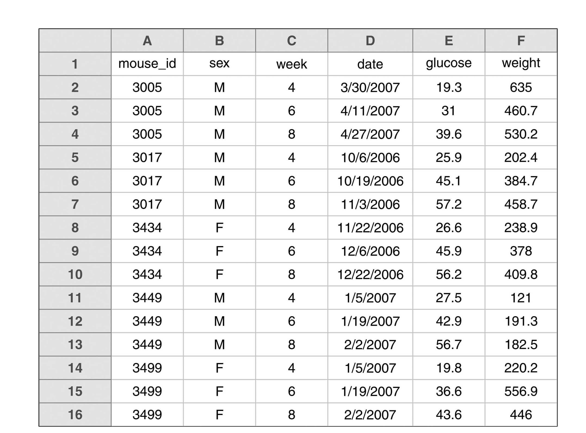

```{r setup, include=FALSE}
knitr::opts_chunk$set(warning = FALSE, message = FALSE, 
                      fig.retina = 3, fig.align = "center")
```

```{r packages-data, include=FALSE}
library(flipbookr)
library(cowplot)
ggplot2::theme_set(theme_cowplot())

```

```{r xaringanExtra, echo=FALSE}
xaringanExtra::use_xaringan_extra(c("tile_view"))
xaringanExtra::use_animate_css()
xaringanExtra::use_animate_all("fade")
xaringanExtra::use_clipboard()
```

class: center middle main-title section-title-1

# Tidy data with .kjh-yellow[tidyr] 

.class-info[

**Session 4**

.light[Kieran Healy<br>
Statistical Horizons, April 2021]

]

---

layout: true
class: title title-1

---

# Load the packages, as always

.SMALL[
```{r 04-tidy-data-1, message = FALSE}
library(here)      # manage file paths
library(socviz)    # data and some useful functions
```
]

.SMALL[

```{r 04-tidy-data-2, message = TRUE}
library(tidyverse) # your friend and mine
library(gapminder) # gapminder data
```
]

---

layout: false
class: main-title main-title-inv

# .middle.squish4.large[.kjh-red[Tidy data]<br />is data in<br />.kjh-red[long] format]

---

layout: true
class: title title-1

---

# The Tidyverse wants to be fed .kjh-yellow[tidy data]

.center[]

---

# Get your data into long-form

Very, very often, the solution to some data-wrangling problem in Tidyverse-focused workflow is:

--

## First, get the data into long format.

--

Then do the recoding thing that you want.

--

Then transform it back to something wider if needed.

---

# This isn't an _iron_ rule

As we'll see later, `dplyr` has recently acquired the ability to do _rowwise_ operations 

--

```{r 04-tidy-data-3}
# Sneak peek
edu %>% 
  select(year, elem4:coll4)

```

---

# This isn't an .kjh-red[_iron_] rule

```{r 04-tidy-data-4}
edu %>% 
  select(year, elem4:coll4) %>% 
  rowwise() %>% #<<
  mutate(mean_of_row = mean(c_across(elem4:coll4)))

```

---

layout: false
class: main-title main-title-inv

# .middle.squish4.large[It is a<br />.kjh-orange[pretty good]<br />rule though]

---

layout: true
class: title title-1

---

# Tidy data

```{r 04-tidy-data-5}
gapminder
```

---

# Tidy data

.center[]

---

# Tidy data

.center[]

.smaller.footnote[Grolemund & Wickham (2017)]

---

# Tidy data

## Each variable has its own column.

## Each observation has its own row.

## Each value has its own cell.

--

When data is tidy in this way, the vectorized character of R's way of doing things works best. 

---

# Untidy data is common for good reasons

.center[]

---

# Untidy data is common for good reasons

Storing data in long form is often _inefficient_

```{r 04-tidy-data-6}
library(covdata)
covus %>% 
  filter(state == "NY") %>% 
  select(date:fips, measure:count)
```

---

# Untidy data is common for good reasons

Storing data in wide form is _easier to display_ in a printed table

.small[
```{r 04-tidy-data-7}
library(palmerpenguins)
penguins %>% 
  group_by(species, island, year) %>% 
  summarize(bill = round(mean(bill_length_mm, na.rm = TRUE),2)) %>% 
  kable()
```
]

---

# Untidy data is common for good reasons

Storing data in wide form is _easier to display_ in a printed table

.small[
```{r 04-tidy-data-8}
penguins %>% 
  group_by(species, island, year) %>% 
  summarize(bill = round(mean(bill_length_mm, na.rm = TRUE), 2)) %>% 
  pivot_wider(names_from = year, values_from = bill) %>% 
  kable()
```
]

.tiny.footnote[(Again, these tables are made directly in R with the code you see here.)]


---

# It's also common for .kjh-orange[_less_] good reasons

.center[]

---

# It's also common for .kjh-orange[_less_] good reasons

.pull-left[]

.pull-right[

More than one header row

Mixed data types in some columns

Color and typography used to encode variables and their values
]
---


# Fix it .kjh-yellow[before] you import it

Prevention is better than cure!

An excellent article by Karl Broman and Kara Woo: 

- .smaller.squish3[Broman KW, Woo KH (2018) "[Data organization in spreadsheets](doi:10.1080/00031305.2017.1375989)." _The American Statistician_ 78:2–10]

.center[]


---

# Key recommendations from Broman & Woo

.pull-left[]

Use a consistent date format

---

layout: false
class: main-title main-title-inv

# .middle.squish4.huge[.kjh-green[ISO 8601]]

## .middle.squish4.huge[.kjh-pink[YYYY-MM-DD]]

.middle.squish4.huge[The one true year-month-day format]
---

layout: true
class: title title-1

---

# Key recommendations from Broman & Woo


No empty cells.

One row of headers only.

---

# Key recommendations from Broman & Woo

.pull-left[]

.pull-right[Tidied version.]

---

# Key recommendations from Broman & Woo

.pull-left[]

.pull-right[Rectangle your data.]

---

# Key recommendations from Broman & Woo

.pull-left[]

.pull-right[Use more than one table if needed. We can join them later.]

---

# Key recommendations from Broman & Woo

.pull-left[]


.pull-right[

Needs a single header row. 

Needs a consistent naming scheme.]

---

# Key recommendations from Broman & Woo

.pull-left[]

.pull-right[Tidied version.]

---

# The most common .kjh-orange[`tidyr`] operation

Pivoting:

.SMALL[
```{r 04-tidy-data-9}
edu
```

The "Level of Schooling Attained" measure is spread across the columns, from `elem4` to `coll4`.


This is fine for a compact table, but for us it should be a single measure, say, "education". 
]
---

# From wide to long with .kjh-yellow[pivot-longer()]

.SMALL.squish2[We're going to put the columns `elem4:coll4` into a new column, creating a new categorical measure named `education`. The numbers currently under each column will become a  new .kjh-green[value] column corresponding to that level of education. ]

```{r 04-tidy-data-10}
edu %>% 
  pivot_longer(elem4:coll4, names_to = "education")
```

---

# From wide to long with .kjh-yellow[pivot-longer()]

.SMALL.squish2[We can name the value column to whatever we like. Here it's a number of people.]

```{r 04-tidy-data-11}
edu %>% 
  pivot_longer(elem4:coll4, names_to = "education", values_to = "n")
```

---

# Let's .kjh-yellow[recode()] it while we're here

```{r 04-tidy-data-12}
edu %>% 
  pivot_longer(elem4:coll4, names_to = "education", values_to = "n") %>% 
  mutate(education = recode(education, 
                            elem4 = "Elementary 4", elem8 = "Elementary 8", 
                            hs3 = "High School 3", hs4 = "High School 4",
                            coll3 = "College 3", coll4 = "College 4"))
  
```

.smaller.squish4[The argument order of `recode()` is inconsistent with other tidyverse functions and it may be superceded in the future.]

---

# .kjh-yellow[pivot_longer()] implies .kjh-yellow[pivot_wider()]

```{r 04-tidy-data-13}
gapminder
```

---

# .kjh-yellow[pivot_longer()] implies .kjh-yellow[pivot_wider()]

```{r 04-tidy-data-14}
gapminder %>% 
  select(country, continent, year, lifeExp) %>% 
  pivot_wider(names_from = year, values_from = lifeExp) #<<
```

---

# What about widening .kjh-yellow[_multiple_] columns?

.SMALL.squish2[
This is a pretty common problem. 

Our first thought ("Just don't mention the other columns") isn't it:
]
```{r 04-tidy-data-15}
gapminder %>% 
  pivot_wider(names_from = year, values_from = lifeExp) 
```

.SMALL.squish2[`pop` and `gdpPercap` are still long, and now our table is really sparse.]


---

# What about widening .kjh-yellow[_multiple_] columns?

.SMALL.squish2[We need to specify that we want values from more than one column.]

.SMALL[
```{r 04-tidy-data-16}
gapminder %>% 
  select(country, continent, year, lifeExp, gdpPercap) %>% 
  pivot_wider(names_from = year, values_from = c(lifeExp, gdpPercap)) #<<
```
]

.SMALL.squish2[This will give us a very wide table, but it's what we wanted.]

---

# What about widening .kjh-yellow[_multiple_] columns?

.small.squish3[Let's see that again. This time, let's say we want to calculate some within-stratum statistics as we do it.]

```{r 04-tidy-data-17, echo = FALSE}
gen_cats <- function(x, N = 1000) {
    sample(x, N, replace = TRUE)
}

set.seed(101)
N <- 1000

income <- rnorm(N, 100, 50)

vars <- list(stratum = c(1:8),
          sex = c("M", "F"),
          race =  c("B", "W"),
          educ = c("HS", "BA"))

df <- as_tibble(map_dfc(vars, gen_cats))
df <- add_column(df, income)
```

```{r 04-tidy-data-18}
# Some made-up data
df
```

???

Let’s say we want to transform this to a wider format, specifically by widening the educ column, so we end up with columns for both the HS and BA categories, and as we do so we want to calculate both the mean of income and the total n within each category of educ

---

```{r 04-pivot-pipeline-case, include = FALSE}
df %>%
    group_by(sex, race, stratum, educ) %>% 
    summarize(mean_inc = mean(income),
              n = n()) %>%
    pivot_wider(names_from = (educ),
                values_from = c(mean_inc, n)) %>% 
    ungroup()
```

`r chunk_reveal("04-pivot-pipeline-case", widths = c(40,60), title = "# Pivot wider while summarizing")`

--

"Over-grouping" is one way to hang on to variables you want during the summary process. All the action happens at the innermost group.

In this case, everthing outside (or to the left of) `stratum` is untouched.

---

# .kjh-yellow[separate()] and .kjh-yellow[unite()] columns

```{r 04-tidy-data-19}
## tribble() lets you make tibbles by hand
df <- tribble(
  ~name, ~occupation,
  "Nero.Wolfe", "Private Detective",
  "Archie.Goodwin", "Personal Assistant",
  "Fritz.Brenner", "Cook and Butler",
  "Theodore.Horstmann", "Orchid Expert"
)

df

```

---

```{r 04-separate-pipe-1, include=FALSE}
df %>% 
  separate(name, into = c("first", "last")) %>% 
  unite("full_name", first:last, sep = " ") %>% 
  unite("both_together", full_name:occupation, 
        sep = ", ", remove = FALSE)

```

`r chunk_reveal("04-separate-pipe-1", widths = c(40,60), title = "# Separate and unite")`

---

```{r 04-separate-pipe-2, include=FALSE}
df %>% 
  separate(name, into = c("first", "last")) %>% 
  unite("full_name", first:last) %>% 
  separate(full_name, into = c("first", "last"))

```

`r chunk_reveal("04-separate-pipe-2", widths = c(40,60), title = "# Separate and unite")`

The underscore, `_`, is the default uniting character.
---

```{r 04-separate-pipe-3, include=FALSE}
gss_sm %>%
    select(race, degree) %>% 
    mutate(racedeg = interaction(race, degree)) %>%
    group_by(racedeg) %>% 
    tally() %>% 
    separate(racedeg, sep = "\\.", into = c("race", "degree"))
```

`r chunk_reveal("04-separate-pipe-3", widths = c(50,50), title = "# Separate and unite")`

This one is a bit trickier, and our first glimpse of a _regular expression_. 

We have to tell `separate()` to split on the period, not the space.

