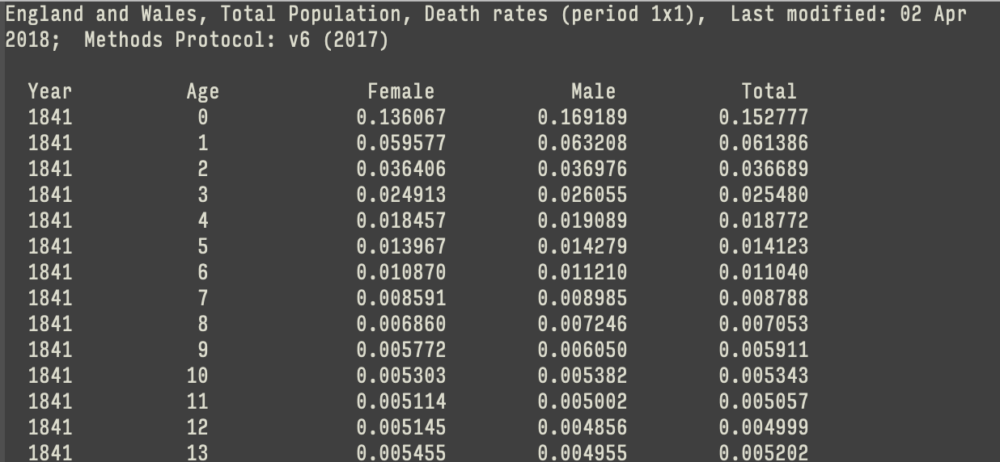
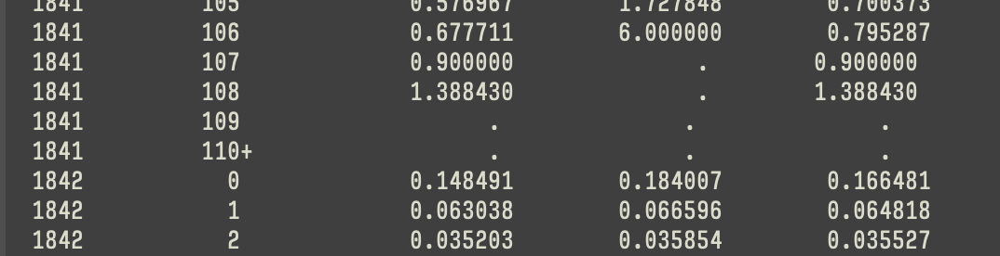
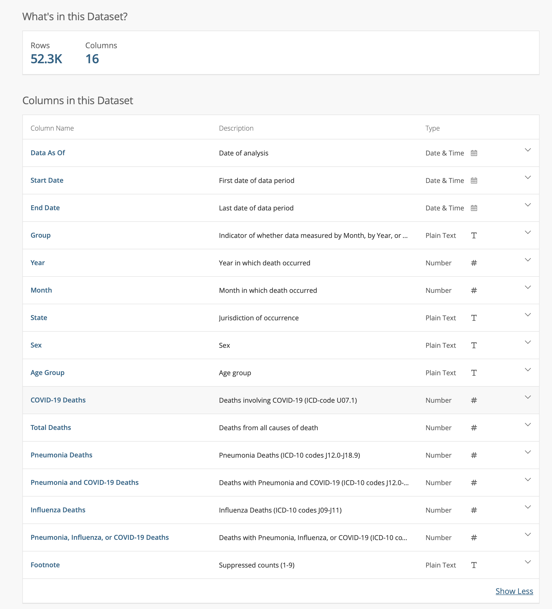
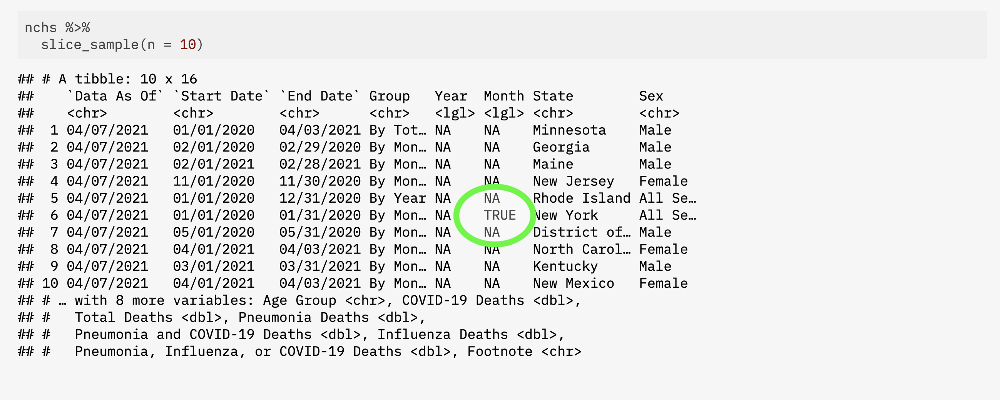
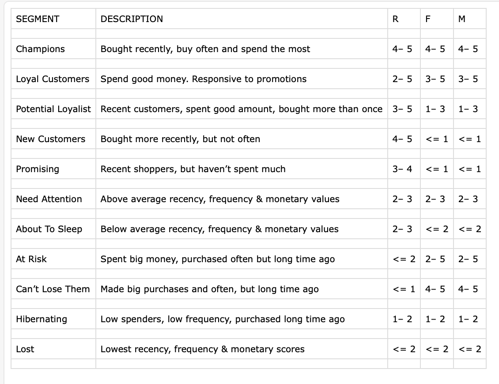

```{r setup, include=FALSE}
knitr::opts_chunk$set(warning = FALSE, message = FALSE, 
                      fig.retina = 3, fig.align = "center")
```

```{r packages-data, include=FALSE}
library(flipbookr)

library(cowplot)
ggplot2::theme_set(theme_cowplot())

```

```{r xaringanExtra, echo=FALSE}
xaringanExtra::use_xaringan_extra(c("tile_view"))
xaringanExtra::use_animate_css()
xaringanExtra::use_animate_all("fade")
xaringanExtra::use_clipboard()
```

class: center middle main-title section-title-1

# Reading in data with .kjh-yellow[readr] and .kjh-yellow[haven]  

.class-info[

**Session 6**

.light[Kieran Healy<br>
Statistical Horizons, April 2022]

]

---

layout: true
class: title title-1

---

# Load the packages, as always

.SMALL[
```{r 06-getting-data-in-1, message = TRUE}
library(here)      # manage file paths
library(socviz)    # data and some useful functions
library(tidyverse) # your friend and mine
library(haven)     # for Stata, SAS, and SPSS files
```
]

---

layout: false
class: center

# .middle.squish4[.kjh-orange[We've put a lot of pieces in place at this point]]

Including several things we haven't fully exploited yet

---

layout: true
class: title title-1

---

# Data we want to get into R

--

Nice, clean CSV files.

--

More troublesome CSVs.

--

Other plain-text formats.

--

Foreign formats, like Stata.

--


Quite messy things like tables on web pages.

--

... and more besides.

---

# Reading in CSV files

CSV is not really a proper format at all!

--

Base R has .kjh-green[**`read.csv()`**]

--

As is often the case, the tidyverse has a corresponding "underscored" version, .kjh-green[**`read_csv()`**].
It is _much_ pickier and more talkative than the Base R version.

???

It's very hazily defined. This makes it surprisingly difficult to parse! Yet is the most common of all plain-text data formats

---

# Where's the data? Using .kjh-yellow[here()]

If we're loading a file, it's coming from _somewhere_.

If it's on our local disk somewhere, we will need to interact with the file system. We should try to do this in a way that avoids _absolute_ file paths. 

```r
# This is not portable
df <- read_csv("/Users/kjhealy/Documents/data/misc/project/data/mydata.csv")
```

--
  
We should also do it in a way that is _platform independent_. 

This makes it easier to share your work, move it around, etc. Projects should be self-contained.

---

# Where's the data? Using .kjh-yellow[here()]

The `here` package, and .kjh-green[**`here()`**] function builds paths relative to the top level of your R project. 

```{r 06-getting-data-in-2}
here() # this path will be different for you
```

---

# Where's the data? Using .kjh-yellow[here()]

This seminar's files all live in an RStudio project. It looks like this:

```{r 06-getting-data-in-3, echo = FALSE}
fs::dir_tree(here(), recurse = 0)
```

I want to load files from the `data` folder, but I also want _you_ to be able to load them. I'm writing this from somewhere deep in the `slides` folder, but you won't be there. Also, I'm on a Mac, but you may not be.

---

# Where's the data? Using .kjh-yellow[here()]

 So:

```{r 06-getting-data-in-4}
## Load the file relative to the path from the top of the project, without separators, etc
organs <- read_csv(file = here("data", "organdonation.csv"))
```

--
.SMALL[

```{r 06-getting-data-in-5}
organs
```

]

.small[And there it is.]

---

# Where's the data? Using .kjh-yellow[here()]

Get in the habit of putting this at the top of your files:

```r
here::i_am("analysis.Rmd") # or whatever your Rmd or R file is called
```

See [the `here` project page](https://here.r-lib.org) for more details.

---

# .kjh-yellow[read_csv()] comes in different varieties


## .kjh-green[**`read_csv()`**] Field separator is a comma: .kjh-red[**`,`**]

```{r 06-getting-data-in-6}
organs <- read_csv(file = here("data", "organdonation.csv"))
```

## .kjh-green[**`read_csv2()`**] Field separator is a semicolon: .kjh-red[**`;`**]

```r
# Example only
my_data <- read_csv2(file = here("data", "my_euro_file.csv))
```

Both are special cases of .kjh-green[**`read_delim()`**]

---

# Other species are also catered to

- .kjh-green[**`read_tsv()`**] Tab separated.

- .kjh-green[**`read_fwf()`**] Fixed-width files.

- .kjh-green[**`read_log()`**] Log files (i.e. computer log files).

- .kjh-green[**`read_lines()`**] Just read in lines, without trying to parse them.

---

# Also often useful ...

- .kjh-green[**`read_table()`**]  

Data that's separated by one (or more) columns of space.


---

# You can read files remotely, too

.SMALL.squish3[
You can give all of these functions local files, or they can point to URLs.

Compressed files will be automatically uncompressed.

(Be careful what you download from remote locations!)]

.SMALL[
```{r 06-getting-data-in-7}
organ_remote <- read_csv("http://kjhealy.co/organdonation.csv")

organ_remote
```
]

---

# An example: .kjh-yellow[read_table()]

.pull-left[

<br />


]

--

.pull-right[

```{r 06-getting-data-in-8}
engmort <- read_table(here("data", "mortality.txt"), 
                      skip = 2, na = ".")

engmort
```

]

---

# Attend to the .kjh-yellow[column specification]

```{r 06-getting-data-in-9, message=TRUE}
engmort <- read_table(here("data", "mortality.txt"), 
                      skip = 2, na = ".")

```


The column specification tells you what the read function did. That is, how it interpreted each of the columns. It will also report if things don't go as expected. 

--

Why is `age` imported in `character` format?


---

# Attend to the .kjh-yellow[column specification]

Absent you giving them a column specification, the `read_` functions try to _guess_ what the type of each column is. They do this by looking at the first thousand rows of each column. 

They may guess incorrectly!

---

```{r 06-janitor-pipeline, include = FALSE}
read_table(here("data", "mortality.txt"), 
           skip = 2, na = ".") %>% 
  janitor::clean_names() %>% 
  mutate(age = as.integer(recode(age, "110+" = "110")))
```

`r chunk_reveal("06-janitor-pipeline", widths = c(40,60), title = "# Normalizing names and recoding")`

--

The `janitor` package is very handy! 

The main cost of normalizing names comes with, e.g., data where there is a codebook you need to consult. But in general it's worth it.

---

# More on column specifications

CDC/NCHS data: [Provisional COVID-19 Death Counts by Sex, Age, and State](https://data.cdc.gov/NCHS/Provisional-COVID-19-Death-Counts-by-Sex-Age-and-S/9bhg-hcku)


---

# More on column specifications



---

# Let's try to load it


```{r 06-getting-data-in-11, warning = TRUE}
nchs <- with_edition(1, read_csv(here("data", "SAS_on_2021-04-13.csv")))
```

---

# Let's try to load it

```{r 06-getting-data-in-12}
problems(nchs)
```

--

Problems are stored as an attribute of the `nchs` object, so we can revisit them.

--

Parsing failures tend to cascade. Our data only has 56k rows but we got 88k failures.

???

A meta-tibble!

---

# Take a look with .kjh-yellow[head()]

```{r 06-getting-data-in-13}
head(nchs)
```


---

# Take a look with .kjh-yellow[tail()]

```{r 06-getting-data-in-14}
tail(nchs)
```

---

# Take a look with .kjh-yellow[slice_sample()]

```{r 06-getting-data-in-15}
nchs %>% 
  slice_sample(n = 10)
```

---

# Aside: one that happened earlier ...



???

Month 1!

---

# Take a look with .kjh-yellow[slice()]

Let's look at the rows .kjh-green[**`read_csv()`**] complained about.

```{r 06-getting-data-in-16}
nchs %>% 
  slice(2750:2760) 
```

---

# Take a look with .kjh-yellow[slice()]

```{r 06-getting-data-in-17}
nchs %>% 
  slice(2750:2760) %>% 
  select(Year, Month, State)
```

Hm, something to do with the transition to national numbers maybe?

---

# Take a look  with .kjh-yellow[select()] and .kjh-yellow[filter()]


```{r 06-getting-data-in-18}
nchs %>% 
  select(Year, Month, State) %>% 
  filter(State == "New York")

```

---

# Take a look with .kjh-yellow[is.na()]

```{r 06-getting-data-in-19}
nchs %>% 
  select(Year, Month, State) %>% 
  filter(!is.na(Year)) #<<
```

It really has been read in as a completely empty column.

That doesn't seem like it can be right.

---

# Take a look with .kjh-yellow[distinct()]

```{r 06-getting-data-in-20}
nchs %>% 
  select(Year) %>% 
  distinct(Year)

```

Again, it's been read in as a completely empty column.

---

# Take a look with .kjh-yellow[read_lines()]

Time to reach for a different kitchen knife.

```{r 06-getting-data-in-21}
read_lines(here("data", "SAS_on_2021-04-13.csv"), n_max = 10)
```

---

# We can get the whole thing this way

```{r 06-getting-data-in-22}
raw_file <- read_lines(here("data", "SAS_on_2021-04-13.csv"))
```

This imports the data as a long, long character vector, with each element being a line. 

```{r 06-getting-data-in-23}
# reminder: indexing 1D vectors
letters[5:6]
```

---

# Now we're just looking at lines in a file

```{r 06-getting-data-in-24}
# This is not a tibble; we have to index it the basic way
raw_file[2753:2758] 
```

--

There you are, you little bastard.

--

In this case, this is due to the kind of data this is, mixing multiple reporting levels and totals. That is, it's not a mistake in the _data_, but rather in the _parsing_.

---

# OK, let's go back to the colspec!

```{r 06-getting-data-in-25, message = TRUE}
nchs <- with_edition(1, read_csv(here("data", "SAS_on_2021-04-13.csv"))) 
```

We can just copy it from the console output! It's valid code.

---

# We use it with .kjh-yellow[col_types]

```r
nchs <- with_edition(1, read_csv(here("data", "SAS_on_2021-04-13.csv"), 
           col_types = cols(
  `Data As Of` = col_character(),
  `Start Date` = col_character(),
  `End Date` = col_character(),
  Group = col_character(),
  Year = col_logical(),
  Month = col_logical(),
  State = col_character(),
  Sex = col_character(),
  `Age Group` = col_character(),
  `COVID-19 Deaths` = col_double(),
  `Total Deaths` = col_double(),
  `Pneumonia Deaths` = col_double(),
  `Pneumonia and COVID-19 Deaths` = col_double(),
  `Influenza Deaths` = col_double(),
  `Pneumonia, Influenza, or COVID-19 Deaths` = col_double(),
  Footnote = col_character()
)))

```


But we know we need to make some adjustments.

???

Copying a _valid_ colspec is good practice if the underlying data changes!

---

# Fixes

.SMALL[
```{r 06-getting-data-in-26}
# Date format
us_style <-  "%m/%d/%Y" #<<

nchs <- with_edition(1, read_csv(
  here("data", "SAS_on_2021-04-13.csv"),
  col_types = cols(
    `Data As Of` = col_date(format = us_style),#<<
    `Start Date` = col_date(format = us_style),#<<
    `End Date` = col_date(format = us_style),#<<
    Group = col_character(),
    Year = col_character(),#<<
    Month = col_character(),#<<
    State = col_character(),
    Sex = col_character(),
    `Age Group` = col_character(),
    `COVID-19 Deaths` = col_integer(),
    `Total Deaths` = col_integer(),
    `Pneumonia Deaths` = col_integer(),
    `Pneumonia and COVID-19 Deaths` = col_integer(),
    `Influenza Deaths` = col_integer(),
    `Pneumonia, Influenza, or COVID-19 Deaths` = col_integer(),
    Footnote = col_character()
  )) %>% 
  janitor::clean_names() %>% 
  select(-footnote) %>%
  mutate(age_group = stringr::str_to_sentence(age_group)) %>%
  filter(!stringr::str_detect(state, "Total"))
)
```
]
---

# Now let's look again

```{r 06-getting-data-in-27}
dim(nchs)

nchs %>% 
  select(year, month, state) %>% 
  filter(!is.na(year)) #<<
```

---

# Now let's look again

```{r 06-getting-data-in-28}
nchs %>% 
  distinct(year) #<<

```

---

# Lessons learned

--

I said at the start that it was no fun, but also weirdly satisfying.

--

When .kjh-green[**`read_csv()`**] warns you of a parsing failure _don't ignore it_.

--

.kjh-green[**`read_lines()`**] lets you get the file in a nearly unprocessed form.

--

The `colspec` output is your friend.

---

```{r 06-getting-data-in-29, echo = FALSE}
nchs_fmt <- nchs %>% 
  select(-year, -month) %>% 
  pivot_longer(covid_19_deaths:pneumonia_influenza_or_covid_19_deaths, 
               names_to = "outcome", 
               values_to = "n") %>% 
  mutate(outcome = str_to_sentence(outcome), 
         outcome = str_replace_all(outcome, "_", " "),
         outcome = str_replace(outcome, "(C|c)ovid 19", "COVID-19"))
```


```{r nchs-pipeline-02, include=FALSE}
library(stringr) # it's back!

nchs %>% 
  select(!(c(data_as_of:end_date, year, month))) %>% 
  pivot_longer(covid_19_deaths:pneumonia_influenza_or_covid_19_deaths, 
               names_to = "outcome", 
               values_to = "n") %>% 
  mutate(outcome = str_to_sentence(outcome), 
         outcome = str_replace_all(outcome, "_", " "),
         outcome = str_replace(outcome, "(C|c)ovid 19", "COVID-19"))
```

`r chunk_reveal("nchs-pipeline-02", widths = c(50,50), title = "# If we wanted to ...")`


--

Put this in `nchs_fmt`

---

# ... we could make a table or graph

```{r 06-getting-data-in-31}
nchs_fmt %>% 
  select(state, age_group, outcome, n)
```

---

# Cleaned up (but not tidy)

.pull-left[
```{r 06-getting-data-in-32}
nchs_fmt %>% 
  distinct(group)
```
]

--

.pull-right[
```{r 06-getting-data-in-33}
nchs_fmt %>% 
  distinct(age_group)
```
]

---

# Make our plot

```{r 06-getting-data-in-34}
p_out <- nchs_fmt %>% 
  filter(group %in% "By Total", 
         sex %in% "All Sexes", 
         state %in% "United States", 
         age_group %in% c("0-17 years", 
                          "18-29 years",
                          "30-39 years",
                          "40-49 years",
                          "50-64 years",
                          "65-74 years",
                          "85 years and over"),  
         outcome %in% "COVID-19 deaths") %>%
  mutate(age_group = str_replace(age_group, "years", "yrs"),#<<
         age_group = str_replace(age_group, " and over", ""),#<<
         age_group = str_replace(age_group, "85", "85+")) %>% #<<
  ggplot(mapping = aes(x = n, y = age_group)) +
  geom_col() + scale_x_continuous(labels = scales::comma) + 
  labs(x = "Deaths", y = NULL, title = "U.S. COVID-19 mortality totals by age group")
```

---

# Result

```{r 06-getting-data-in-35, echo = FALSE}
#theme_set(cowplot::theme_minimal_grid())
```


```{r 06-getting-data-in-36, fig.height=5, fig.width=12}
p_out
```

---

layout: false
class: center

# .middle.squish4.huge[.kjh-orange[Every dataset is different]]

---

layout: true
class: title title-1

---

# Dropping .kjh-orange[missing values]: a quick demo

```{r 06-getting-data-in-37}
df <- tribble(
  ~a, ~b, ~c,
  1, NA, 2,
  NA, NA, NA, 
  2, 2, 2
)

df

```

---

# Dropping .kjh-orange[missing values]: a quick demo

```{r 06-getting-data-in-38}
# 1 Write it yourself
df %>% 
  filter(complete.cases(.))

# 2 Convenience function
df %>% 
  drop_na()

```

Both drop all rows with _any_ missing cases.

---

# Dropping .kjh-orange[missing values]: a quick demo

What if we only want to drop all rows with _all_ missing cases?

```{r 06-getting-data-in-39}
# 3
df %>% 
  filter(!if_all(everything(), ~ is.na(.x))) # Pronoun

# 4 Convenience function from janitor
df %>% 
  janitor::remove_empty("rows")

```

.small[Read **`.x`** as "the column we're looking at" or "the variable we're computing on right now".]

???

This is the kind of thing where you'll find ten different ways online to do it

---

# Cleaning a table

With that in mind ... Some marketing data



---

```{r 06-clean-table-pipeline, include = FALSE}

read_csv(here("data", "rfm_table.csv")) %>% 
  janitor::clean_names() %>%
  janitor::remove_empty("rows") %>% 
  pivot_longer(cols = r:m) %>% 
  separate(col = value, into = c("lo", "hi"), 
           remove = FALSE, convert = TRUE, 
           fill = "left") %>%
  select(-value) %>%
  pivot_wider(names_from = name, 
              values_from = lo:hi) %>%
  mutate(across(where(is.integer), replace_na, 0)) %>% 
  select(segment, 
         lo_r, hi_r, 
         lo_f, hi_f, 
         lo_m, hi_m, 
         description)
```

`r chunk_reveal("06-clean-table-pipeline", widths = c(40,60), title = "# Cleaning a table")`

---

# Maybe a candidate for .kjh-green[`rowwise()`]?

```{r 06-getting-data-in-41, echo = FALSE}
rfm_table <- read_csv(here("data", "rfm_table.csv")) %>% 
  janitor::clean_names() %>%
  janitor::remove_empty("rows") %>% 
  pivot_longer(cols = r:m) %>% 
  separate(col = value, into = c("lo", "hi"), 
           remove = FALSE, convert = TRUE, 
           fill = "left") %>%
  select(-value) %>%
  pivot_wider(names_from = name, 
              values_from = lo:hi) %>%
  mutate(across(where(is.integer), replace_na, 0)) %>% 
  select(segment, 
         lo_r, hi_r, 
         lo_f, hi_f, 
         lo_m, hi_m, 
         description)

```

```{r 06-getting-data-in-42}
rfm_table
```

---

# Maybe a candidate for .kjh-green[`rowwise()`]?

This does what we expect:

```{r 06-getting-data-in-43}
rfm_table %>% 
  mutate(sum_lo = lo_r + lo_f + lo_m,#<<
         sum_hi = hi_r + hi_f + hi_m) %>% #<<
  select(segment, sum_lo, sum_hi, everything())
```

This adds each column, elementwise.

---

# Maybe a candidate for .kjh-green[`rowwise()`]?

.squish4[But this does not:]

```{r 06-getting-data-in-44}
rfm_table %>% 
  mutate(sum_lo = sum(lo_r, lo_f, lo_m),#<<
         sum_hi = sum(hi_r, hi_f, hi_m)) %>%#<< 
  select(segment, sum_lo, sum_hi, everything())


```

.SMALL.squish3[Sum is taking all the columns, adding them up (into a single mumber), and putting that result in each row.]

---

# Maybe a candidate for .kjh-green[`rowwise()`]?

Similarly, this will not give the answer we probably expect:

```{r 06-getting-data-in-45}
rfm_table %>% 
  mutate(mean_lo = mean(c(lo_r, lo_f, lo_m)),#<<
         mean_hi = mean(c(hi_r, hi_f, hi_m))) %>%#<< 
  select(segment, mean_lo, mean_hi, everything())


```

---

# Maybe a candidate for .kjh-green[`rowwise()`]?

But this will:

```{r 06-getting-data-in-46}
rfm_table %>% 
  rowwise() %>% #<<
  mutate(mean_lo = mean(c(lo_r, lo_f, lo_m)),#<<
         mean_hi = mean(c(hi_r, hi_f, hi_m))) %>%#<< 
  select(segment, mean_lo, mean_hi, everything())

```

---

# Rowwise isn't very efficient

In general, you'll want to see if some vectorized ("operating on columns, but elementwise") function exists, as it'll be faster. 

And most of the time, R and the tidyverse "wants" you to work in vectorized, columnar terms ... hence your first move will often be to pivot the data into long format. 

So, .kjh-green[**`rowwise()`**] is not likely to see a whole lot of further development. 

---

# You probably want .kjh-green[`group_by()`] instead

```{r 06-getting-data-in-47}
rfm_table %>% 
  group_by(segment) %>% 
  mutate(mean_lo = mean(c(lo_r, lo_f, lo_m)),#<<
         mean_hi = mean(c(hi_r, hi_f, hi_m))) %>%#<< 
  select(segment, mean_lo, mean_hi, everything())

```

---

# You probably want .kjh-green[`group_by()`] instead


```{r 06-getting-data-in-48}
rfm_table %>% 
  group_by(segment) %>% 
  mutate(sum_lo = sum(lo_r, lo_f, lo_m),#<<
         sum_hi = sum(hi_r, hi_f, hi_m)) %>%#<< 
  select(segment, sum_lo, sum_hi, everything())

```

---

layout: false
class: center

# .middle.squish4[.kjh-orange[What about Stata?]]

---

layout: true
class: title title-1

---

# Using .kjh-green[haven]

Haven is the Tidyverse's package for reading and managing files from Stata, SPSS, and SAS. You should prefer it to the older Base R package `foreign`, which has similar functionality.

We're going to import a General Social Survey dataset that's in Stata's `.dta` format.


```{r 06-getting-data-in-49}
library(haven)

# This will take a moment
gss_panel <- read_stata(here("data", "gss_panel_long.dta"))

```

We'll do some of the common recoding and reorganizing tasks that accompany this. 

---
# The GSS panel

.SMALL.squish4[The data:]

```{r 06-getting-data-in-50}
gss_panel
```

---

# The GSS panel

Many variables.

Stata's missing value types are preserved

Data types are things like `dbl+lbl` indicating that Stata's numeric values and variable labels have been preserved. 

---

# The GSS panel

You can see the labeling system at work:

```{r 06-getting-data-in-51}
gss_panel %>% 
  select(degree) %>% 
  group_by(degree) %>% 
  tally()
```

---

# The GSS panel

Values get pivoted, not labels, though.

```{r 06-getting-data-in-52}
gss_panel %>% 
  select(sex, degree) %>% 
  group_by(sex, degree) %>% 
  tally() %>% 
  pivot_wider(names_from = sex, values_from = n)
```

---

# The GSS panel

.SMALL.squish4[Option 1: Just drop all the labels.]

.SMALL[

```{r 06-getting-data-in-53}
gss_panel %>% 
  zap_missing() %>% 
  zap_labels()
```

]

---

layout: true
class: title title-1

---

# The GSS panel

.SMALL.squish4[Option 2: Convert the labels]

.SMALL.squish4[Let's focus on a few measures of interest, and do some recoding.]

```{r 06-getting-data-in-54}

## Categorical vars
cat_vars <- c("race", "sex", "degree", "relig", "income", "polviews", "fefam")

## Integer vars
int_vars <- c("year", "id", "ballot", "age", "tvhours")


## Survey design
wt_vars <- c("vpsu",
             "vstrat",
             "oversamp",
             "formwt",              # weight to deal with experimental randomization
             "wtssall",             # weight variable
             "sampcode",            # sampling error code
             "sample")              # sampling frame and method


my_gss_vars <- c(int_vars, cat_vars, wt_vars)

```


.SMALL[Now we're ready to go ...]

---

layout: true
class: title title-1

---

# Cut down the dataset

```{r 06-getting-data-in-55}
gss_sub <- gss_panel %>% 
  select(all_of(my_gss_vars))

gss_sub
```


---

# The GSS Panel: Recoding

```{r gssproblem}

gss_sub %>% 
  mutate(across(everything(), zap_missing)) %>% 
  mutate(across(all_of(wt_vars), as.numeric)) %>% 
  mutate(across(all_of(int_vars), as.integer)) %>% 
  mutate(across(all_of(cat_vars), as_factor)) %>%
  mutate(across(all_of(cat_vars), fct_relabel, tolower)) %>% 
  mutate(across(all_of(cat_vars), fct_relabel, tools::toTitleCase)) %>% 
  mutate(income = stringr::str_replace(income, " - ", "-")) 

```

---

# How we'd actually write this

```{r 06-getting-data-in-57}
gss_sub <- gss_sub %>% 
  mutate(across(everything(), zap_missing), 
         across(all_of(wt_vars), as.numeric), 
         across(all_of(int_vars), as.integer), 
         across(all_of(cat_vars), as_factor),
         across(all_of(cat_vars), fct_relabel, tolower), 
         across(all_of(cat_vars), fct_relabel, tools::toTitleCase), 
         income = stringr::str_replace(income, " - ", "-")) 
```

---

# The GSS panel: more recoding

Age quintiles: find the cutpoints

```{r 06-getting-data-in-58}
# seq can make all kinds of sequences
seq(from = 0, to = 1, by = 0.2)

age_quintiles <- quantile(as.numeric(gss_panel$age), 
                      probs = seq(0, 1, 0.2), 
                      na.rm = TRUE)

## These are the quintile cutpoints
age_quintiles
```

---

# The GSS panel: more recoding

Age quintiles: create the quintile variable

```{r 06-getting-data-in-59}
## Apply the cut
gss_sub %>% 
  mutate(agequint = cut(x = age, 
                          breaks = unique(age_quintiles), 
                          include.lowest = TRUE)) %>% 
  pull(agequint) %>% # grab a column and make it an ordinary vector
  table()

```

We'll need to clean up those labels.

---

# The GSS panel: more recoding

I told you that regexp stuff would pay off.

```{r 06-getting-data-in-60}

convert_agegrp <- function(x){
    x <- stringr::str_remove(x, "\\(")  # Remove open paren
    x <- stringr::str_remove(x, "\\[")  # Remove open bracket
    x <- stringr::str_remove(x, "\\]")  # Remove close bracket
    x <- stringr::str_replace(x, ",", "-") # Replace comma with dash
    x <- stringr::str_replace(x, "-89", "+") # Replace -89 with + 
    regex <- "^(.*$)" # Matches everything in string to end of line
    x <- stringr::str_replace(x, regex, "Age \\1") # Preface string with "Age" 
    x
}

```

---

```{r gss-recode-pipeline-2, include = FALSE}
gss_sub %>%
    mutate(agequint = cut(x = age, 
                          breaks = unique(age_quintiles), 
                          include.lowest = TRUE)) %>% 
    mutate(agequint = fct_relabel(agequint, convert_agegrp)) %>% 
    mutate(year_f = droplevels(factor(year))) %>% 
    mutate(young = ifelse(age < 26, "Yes", "No")) %>% 
    mutate(fefam_d = fct_recode(fefam,
                                Agree = "Strongly Agree",
                                Disagree = "Strongly Disagree")) %>% 
    mutate(degree = factor(degree, 
                           levels = levels(gss_sub$degree), #<<
                           ordered = TRUE))#<<
```

`r chunk_reveal("gss-recode-pipeline-2", widths = c(45,55), title = "# The GSS panel: more recoding")`

---

# How we'd actually write this

```{r 06-getting-data-in-61}
gss_sub <- gss_sub %>%
      mutate(agequint = cut(x = age, 
                            breaks = unique(age_quintiles), 
                            include.lowest = TRUE), 
              agequint = fct_relabel(agequint, convert_agegrp), 
              year_f = droplevels(factor(year)),#<<  
              young = ifelse(age < 26, "Yes", "No"), 
              fefam_d = fct_recode(fefam,
                                  Agree = "Strongly Agree",
                                  Disagree = "Strongly Disagree"),
              degree = factor(degree, 
                             levels = levels(gss_sub$degree), 
                             ordered = TRUE))
```

---

# How we'd actually write this

```{r 06-getting-data-in-62}
gss_sub <- gss_sub %>%
    mutate(agequint = cut(x = age, 
                          breaks = unique(age_quintiles), 
                          include.lowest = TRUE), 
            agequint = fct_relabel(agequint, convert_agegrp), 
            year_f = factor(year),  
            young = ifelse(age < 26, "Yes", "No"),#<< 
            fefam_d = fct_recode(fefam,
                                Agree = "Strongly Agree",
                                Disagree = "Strongly Disagree"),
            degree = factor(degree, 
                           levels = levels(gss_sub$degree), 
                           ordered = TRUE))
```

---
# How we'd actually write this

```{r 06-getting-data-in-63}
gss_sub <- gss_sub %>%
    mutate(agequint = cut(x = age, 
                          breaks = unique(age_quintiles), 
                          include.lowest = TRUE), 
            agequint = fct_relabel(agequint, convert_agegrp), 
            year_f = droplevels(factor(year)),  
            young = ifelse(age < 26, "Yes", "No"), 
            fefam_d = fct_recode(fefam,
                                Agree = "Strongly Agree",
                                Disagree = "Strongly Disagree"),
            degree = factor(degree, 
                           levels = levels(gss_sub$degree), 
                           ordered = TRUE))#<<
```

---

# GSS Panel

```{r 06-getting-data-in-64}
gss_sub %>% 
  select(sex, year, year_f, age, young, fefam, fefam_d) %>% 
  sample_n(15)
```

---

# GSS Panel

```{r 06-getting-data-in-65}
gss_sub %>% 
  select(sex, degree) %>% 
  group_by(sex, degree) %>% 
  tally() %>% 
  pivot_wider(names_from = sex, values_from = n)
```

---

# More on .kjh-yellow[factors]

We've already seen .kjh-green[**`fct_relabel()`**] and .kjh-green[**`fct_recode()`**] from forcats. 

There are numerous other convenience functions for factors.

--

```{r}
gss_sub %>% 
  count(degree)
```

```{r}
levels(gss_sub$degree)
```

---

# More on .kjh-yellow[factors]

Make the .kjh-red[NA] values an explicit level

```{r}
gss_sub %>% 
  mutate(degree_na = fct_explicit_na(degree)) %>% 
  count(degree_na)
```

---

# More on .kjh-yellow[factors]

Relevel by frequency

```{r}
gss_sub %>% 
  mutate(degree_freq = fct_infreq(degree)) %>% 
  count(degree_freq) 
```

---

# More on .kjh-yellow[factors]

Relevel manually

```{r}
is.ordered(gss_sub$sex)
levels(gss_sub$sex)
```

---

```{r}
summary(lm(age ~ sex, data = gss_sub))
```

---

# More on .kjh-yellow[factors]

Relevel manually

```{r}
gss_sub <- gss_sub %>% 
  mutate(sex = fct_relevel(sex, "Female"))

levels(gss_sub$sex)
```

--

```{r}
summary(lm(age ~ sex, data = gss_sub))
```

---

# More on .kjh-yellow[factors]

Interact or cross factors

.SMALL[

```{r}
gss_sub <- gss_sub %>% 
  mutate(degree_by_race = fct_cross(race, degree))

gss_sub %>% 
  count(degree_by_race)
```

]

---

# More on .kjh-yellow[factors]

Relevel manually by lumping ... the least frequent n

```{r}
gss_sub %>% 
  mutate(degree_n = fct_lump_n(degree, n = 3)) %>% 
  count(degree_n)
```

---

# More on .kjh-yellow[factors]

Relevel manually by lumping ...to other, manually

```{r}
gss_sub %>% 
  mutate(degree_o = fct_other(degree, 
                              keep = c("Lt High School", 
                                       "High School"))) %>% 
  count(degree_o)
```


