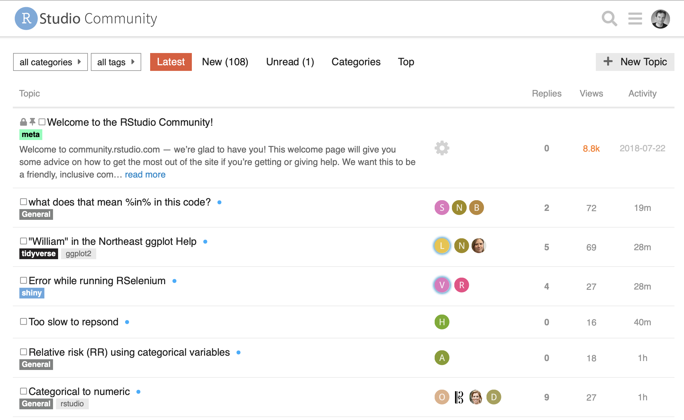
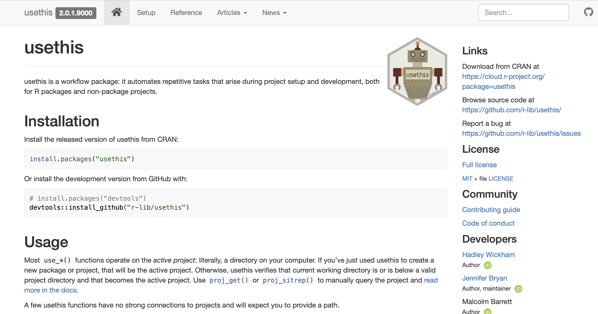
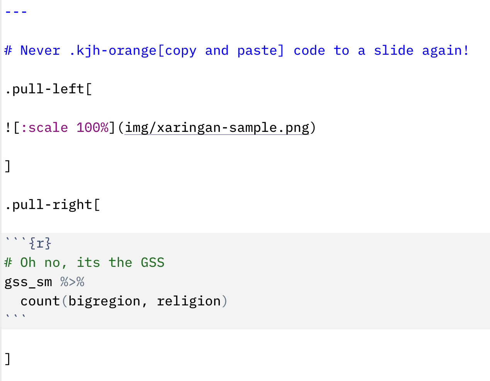

```{r packages, include=FALSE}
library(flipbookr)
library(here)
library(tidyverse)
library(kjhslides)
```


```{r setup, include=FALSE}

kjh_register_tenso()
kjh_set_knitr_opts()
kjh_set_slide_theme()
kjh_set_xaringan_opts()

```


class: center middle main-title section-title-1

# Making it .kjh-green[easier] to be .kjh-yellow[tidy]  

.class-info[

**Data Wrangling: Session 8**

.light[Kieran Healy<br>
Statistical Horizons, October 2023]

]

---

layout: true
class: title title-1

---

# Load the packages, as always

.SMALL[
```{r 08-making-tidy-easier-2, message = TRUE}
library(here)      # manage file paths
library(socviz)    # data and some useful functions
library(tidyverse) # your friend and mine
library(haven)     # for Stata, SAS, and SPSS files

library(broom)     # tidy model summaries
```
]

---

layout: false
class: center

# .middle.squish4.huge[.kjh-orange[Moving ahead]]

---

layout: true
class: title title-1

---

# Some helpful things

---

# The RStudio Community

.center[]


---

# The .kjh-yellow[reprex] package

.center[]

---

# Best demonstrated live

When asking for help, make a .kjh-green[**reproducible example**]

```{r 08-making-tidy-easier-3 }
library(reprex)
```

.SMALL[

```{r 08-making-tidy-easier-4 }
library(tidyverse)

starwars |> 
  count(homeworld, species) |> 
  mutate(pct = n / sum(n) * 100) |> 
  arrange(desc(pct))
```

]
---

# The .kjh-green[usethis] package


.center[]

---

# The packages that made these slides


.pull-left[]


.pull-right[]


---

# Never .kjh-orange[paste] tables into a slide again!

.pull-left[



]

.pull-right[

.small.expand2[
```{r 08-making-tidy-easier-5, echo=FALSE}
# Oh no, its the GSS
gss_sm |> 
  count(bigregion, religion) |> 
  pivot_wider(names_from =  bigregion, 
              values_from  = n) |> 
  knitr::kable()
```
 ]
]


---

# .kjh-orange[Tables], .kjh-yellow[tables], .kjh-green[tables]

The **[gtsummary](http://www.danieldsjoberg.com/gtsummary/)** package is very powerful. There are a number of other very good tidy table-making options too.

```{r 08-making-tidy-easier-6 }
library(gtsummary)

trial
```

---

# .kjh-orange[Tables], .kjh-yellow[tables], .kjh-green[tables]

The **[gtsummary](http://www.danieldsjoberg.com/gtsummary/)** package is very powerful. There are a number of other very good tidy table-making options too.

```{r 08-making-tidy-easier-7, eval = FALSE}
trial |> 
  tbl_summary(
    by = trt, # split table by group
    missing = "no" # don't list missing data separately
  ) |>
  add_n() |> # add column with total number of non-missing observations
  add_p() |> # test for a difference between groups
  modify_header(label = "**Variable**") |> # update the column header
  bold_labels()
```

---

# .kjh-orange[Tables], .kjh-yellow[tables], .kjh-green[tables]

.smaller.expand1[

```{r 08-making-tidy-easier-8, echo = FALSE}
trial |> 
  tbl_summary(
    by = trt, # split table by group
    missing = "no" # don't list missing data separately
  ) |>
  add_n() |> # add column with total number of non-missing observations
  add_p() |> # test for a difference between groups
  modify_header(label = "**Variable**") |> # update the column header
  bold_labels()
```
]


---

# .kjh-orange[Tables], .kjh-yellow[tables], .kjh-green[tables]

.kjh-green[**`gtsummary()`**] straight out of the box: 

```{r 08-making-tidy-easier-9, eval = FALSE}
gss_sm |> 
  select(race, degree, marital) |> 
  drop_na() |> 
  tbl_summary(
    by = race, # split table by group
    missing = "no" # don't list missing data separately
  ) |>
  add_n() |> # add column with total number of non-missing observations
#  modify_header(label = "**Variable**") |> # update the column header
  bold_labels()
```

---

# .kjh-orange[Tables], .kjh-yellow[tables], .kjh-green[tables]

.smaller.expand1[

```{r 08-making-tidy-easier-10, echo = FALSE}
gss_sm |> 
  select(race, degree, marital) |> 
  drop_na() |> 
  tbl_summary(
    by = race, # split table by group
    missing = "no" # don't list missing data separately
  ) |>
  add_n() |> # add column with total number of non-missing observations
  modify_header(label = "**Variable**") |> # update the column header
  bold_labels()
```
]


---

# .kjh-orange[Tables], .kjh-yellow[tables], .kjh-green[tables]

With a bit more work ...


```{r 08-making-tidy-easier-11, eval = FALSE}
trial |>
  select(trt, age, marker) |>
  tbl_summary(
    by = trt,
    type = all_continuous() ~ "continuous2",
    statistic = all_continuous() ~ c("{N_nonmiss}",
                                     "{mean} ({sd})", 
                                     "{median} ({p25}, {p75})", 
                                     "{min}, {max}"),
    missing = "no"
  ) |>
  italicize_levels()
```


---

# .kjh-orange[Tables], .kjh-yellow[tables], .kjh-green[tables]


.small.expand2[

```{r 08-making-tidy-easier-12, echo = FALSE}
trial |>
  select(trt, age, marker) |>
  tbl_summary(
    by = trt,
    type = all_continuous() ~ "continuous2",
    statistic = all_continuous() ~ c("{N_nonmiss}",
                                     "{mean} ({sd})", 
                                     "{median} ({p25}, {p75})", 
                                     "{min}, {max}"),
    missing = "no"
  ) |>
  italicize_levels()
```

]

---

# The power of .kjh-orange[lists]

Similar to earlier, but simpler:

```{r 08-making-tidy-easier-13 }
library(gapminder)

## Fit as a function, for clarity
fit_ols <- function(df) {
    lm(lifeExp ~ log(gdpPercap), data = df)
}


out_le <- gapminder |>
  filter(continent %nin% "Oceania") |> 
  group_by(continent) |>
  nest() |>
  mutate(model = map(data, fit_ols),
         mod_sum = map(model, glance),
         mod_terms = map(model, tidy, conf.int = TRUE),
         ) |>
  unnest(cols = c(mod_terms))

```

---

# The power of .kjh-orange[lists]

```{r 08-making-tidy-easier-14 }
out_le
```


---

# The power of .kjh-orange[lists]

```{r 08-making-tidy-easier-15 }
## Nice formatting of the numbers
## There are many convenience packages
## like this; it's not too hard to write your own, either
# remotes::install_github("tjmahr/printy")

text_ready <- out_le |>
  mutate(
    across(c(estimate, conf.low, conf.high),
           printy::fmt_fix_digits, 2),
    se = printy::fmt_fix_digits(std.error, 3),
    ci = glue::glue("[{conf.low}, {conf.high}]")
  ) |>
  select(continent, term, estimate, se, ci)
  
```

.small[The `printy` package is by [T.J. Mahr](https://github.com/tjmahr/printy)]

---

# The power of .kjh-orange[lists]


```{r 08-making-tidy-easier-16 }
text_ready
```

---

# The power of .kjh-orange[lists]

Now ...

```{r 08-making-tidy-easier-17 }

stats <- text_ready |> 
  mutate(term = janitor::make_clean_names(term)) |>
  printy::super_split(continent, term) # Thanks again, TJ Mahr

```

---

# The power of .kjh-orange[lists]

Why are we doing this?

```{r 08-making-tidy-easier-18 }
stats
```

---

# The power of .kjh-orange[lists]

```text
The Intercept term for Africa was 'r stats$Africa$intercept$estimate' 'r stats$Africa$intercept$ci'. 

For Europe it was 'r stats$Europe$intercept$estimate' 'r stats$Europe$intercept$ci'

```

The Intercept term for Africa was `r stats$Africa$intercept$estimate` `r stats$Africa$intercept$ci`. 

For Europe it was `r stats$Europe$intercept$estimate` `r stats$Europe$intercept$ci`. 

For more, see [this post by TJ Mahr](https://www.tjmahr.com/lists-knitr-secret-weapon/):

<https://www.tjmahr.com/lists-knitr-secret-weapon/>


---

# .kjh-orange[Test] the output of your functions


```{r 08-making-tidy-easier-19 }


countries <- read_csv(here("data", "countries.csv"))

countries

```

---

# .kjh-orange[Test] the output of your functions


```{r 08-making-tidy-easier-20 }
get_stmf <- function(url = "https://www.mortality.org/File/GetDocument/Public/STMF/Outputs",
                     fname = "stmf",
                     date = lubridate::today(),
                     ext = "csv",
                     dest = "data-raw/data",
                     save_file = c("n", "y"),
                     ...) {
  save_file <- match.arg(save_file)
  target <-  fs::path(url, fname, ext = ext)
  message("target: ", target)

  destination <- fs::path(here::here("data-raw/data"),
                          paste0(fname, "_", date), ext = ext)

  tf <- tempfile(fileext = ext)
  curl::curl_download(target, tf)

  switch(save_file,
         y = fs::file_copy(tf, destination),
         n = NULL)

  janitor::clean_names(read_csv(tf, ...))
}


```

---

# .kjh-orange[Test] the output of your functions


```{r 08-making-tidy-easier-21 }
stmf_raw <- read_csv(here("data", "stmf.csv"), skip = 2) |>
  janitor::clean_names() |> 
  rename(deaths_total = d_total, rate_total = r_total) |>
  select(country_code:sex, deaths_total, rate_total, split:forecast, everything()) |>
  pivot_longer(
    cols = d0_14:r85p,
    names_to = c("measure", "age_group"),
    names_pattern = "(r|d)(.*)"
  ) |>
  pivot_wider(names_from = measure,
              values_from = value) |>
  mutate(age_group = stringr::str_replace(age_group, "_", "-"),
         age_group = stringr::str_replace(age_group, "p", "+")) |>
  rename(death_count = d, death_rate = r) |>
  mutate(approx_date = paste0(year, "-", "W", 
                              stringr::str_pad(week, width = 2, pad = "0"), "-", "7"),
         approx_date = ISOweek::ISOweek2date(approx_date)) |>
  select(country_code:sex, split:forecast, approx_date, 
         age_group:death_rate, deaths_total, rate_total) |>
  mutate(country_code = replace(country_code, country_code == "AUS2", "AUS"),
         country_code = replace(country_code, country_code == "NZL_NP", "NZL"))

```

---

# .kjh-orange[Test] the output of your functions

```{r 08-making-tidy-easier-22 }
stmf_raw
```

---

# .kjh-orange[Test] the output of your functions

```{r 08-making-tidy-easier-23 }
md_ccodes <- tibble(country_code = unique(stmf_raw$country_code)) |>
  left_join(countries, by = c("country_code" = "iso3")) |>
  mutate(cname = replace(cname, country_code == "DEUTNP", "Germany"),
         iso2 = replace(iso2, country_code == "DEUTNP", "DE"),
         continent = replace(continent, country_code == "DEU", "Europe"),
         cname = replace(cname, country_code == "FRATNP", "France"),
         iso2 = replace(iso2, country_code == "FRATNP", "FR"),
         continent = replace(continent, country_code == "FRA", "Europe"),
         cname = replace(cname, country_code == "GBRTENW", "England and Wales"),
         cname = replace(cname, country_code == "GBR_SCO", "Scotland"),
         cname = replace(cname, country_code == "GBR_NIR", "Northern Ireland"),
         continent = replace(continent, country_code %in% c("GBRTENW", "GBR_SCO", "GBR_NIR"), "Europe")
         ) |>
  left_join(countries)


stmf <- left_join(stmf_raw, md_ccodes) |>
  select(country_code, cname:iso3, everything()) |>
  mutate(iso3 = replace(iso3, iso2 == "DE", "DEU"),
         iso3 = replace(iso3, iso2 == "FR", "FRA"))

```

---

# .kjh-orange[Test] the output of your functions


```{r 08-making-tidy-easier-24 }

stmf

```

---

# For example, manually

```{r 08-making-tidy-easier-25}

## stmf
stmf_colnames <- c("country_code", "cname", "iso2", "continent", "iso3", "year",
                     "week", "sex", "split", "split_sex", "forecast", "approx_date",
                     "age_group", "death_count", "death_rate", "deaths_total", "rate_total")

all.equal(colnames(stmf), stmf_colnames)


```

--

- Imagine how you might build up a set of tests and checks

--

- But you don't have to manage this manually

---

# Use .kjh-green[testthat] to check things

```{r 08-making-tidy-easier-26, eval = FALSE, echo = TRUE}

## countries
test_that("countries conforms to spec", {
  countries_colnames <- c("cname", "iso3", "iso2", "continent")
  expect_equal(colnames(countries), countries_colnames)
})


## stmf
test_that("stmf conforms to spec", {
  stmf_colnames <- c("country_code", "cname", "iso2", "continent", "iso3", "year",
                     "week", "sex", "split", "split_sex", "forecast", "approx_date",
                     "age_group", "death_count", "death_rate", "deaths_total", "rate_total")
  expect_equal(colnames(stmf), stmf_colnames)
})

```

---

# Use .kjh-green[testthat] to check things


```{r 08-making-tidy-easier-27, eval = FALSE, echo = TRUE}

testthat::test_dir(here("tests", "testthat"))

## ✓ |  OK F W S | Context
## 
## - |   0       | stmf                                                            
## - |   0       | Validating package data objects                                 
## ✓ |   2       | Validating package data objects
## 
## ══ Results ═════════════════════════════════════════════════════════════════════
## [ FAIL 0 | WARN 0 | SKIP 0 | PASS 2 ]


```

---

# .kjh-green[testthat] in practice

### Oriented towards package development

### Consider packaging your datasets! Benefits to documentation/codebooks etc

### One-table example: [uscenpops](https://kjhealy.github.io/uscenpops/)

### More extensive: [covdata](https://kjhealy.github.io/covdata/)

### How R packages work: [Wickham & Bryan](https://r-pkgs.org)

---

# Summarizing your wrangling with .kjh-green[skimr]

- We might want to make a .kjh-orange[codebook] of our data

```{r 08-making-tidy-easier-28 }
library(skimr)
```

---

# Summarizing your wrangling with .kjh-green[skimr]

- We might want to make a .kjh-orange[codebook] of our data


```{r 08-making-tidy-easier-29 }
library(skimr)
organdata <- read_csv(here("data", "organdonation.csv"))

```

---

# Summarizing your wrangling with .kjh-green[skimr]

.tiny[
```{r 08-making-tidy-easier-30 }
organdata |> skim(where(is.numeric)) |> partition()
```
]

---

# Summarizing your wrangling with .kjh-green[skimr]

.smaller2[
```{r 08-making-tidy-easier-31 }
organdata |> skim(!where(is.numeric)) |> partition()
```
]

---

# Custom Summaries

```{r 08-making-tidy-easier-32}
stmf_country_years <- function(df = stmf) {

  df |>
    dplyr::select(cname, year) |>
    dplyr::group_by(cname, year) |>
    dplyr::tally() |>
    dplyr::mutate(n = as.character(n),
           n = dplyr::recode(n, "0" = "-", .default = "Y")) |>
    dplyr::group_by(year, cname) |>
    dplyr::arrange(year) |>
    tidyr::pivot_wider(names_from = year, values_from = n) |>
    dplyr::mutate(dplyr::across(where(is.character), dplyr::recode, .missing = "-")) |>
    dplyr::arrange(cname)
}

```

---

# Custom Summaries

.tiny[

```{r 08-making-tidy-easier-33}
knitr::kable(stmf_country_years())
```

]

---
